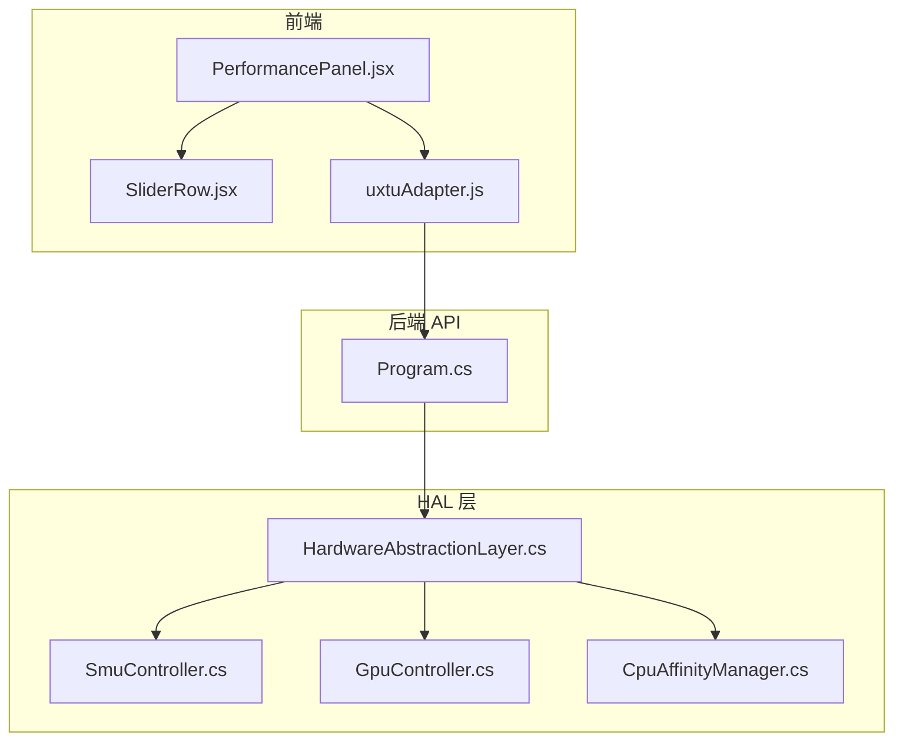
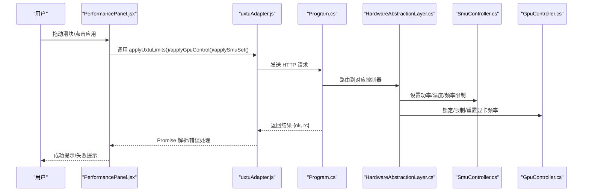
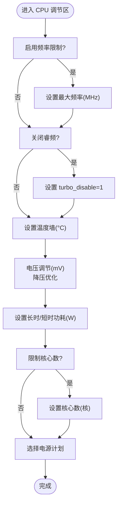
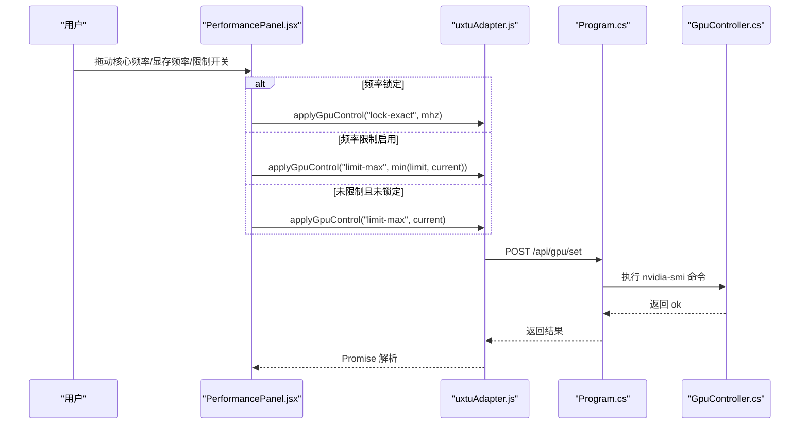
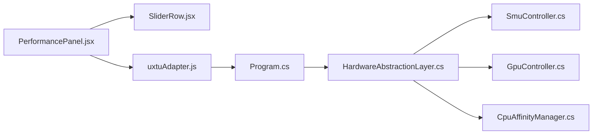

# 性能面板

<cite>
**本文引用的文件**
- [PerformancePanel.jsx](file://src/components/panels/PerformancePanel.jsx)
- [SliderRow.jsx](file://src/components/ui/SliderRow.jsx)
- [uxtuAdapter.js](file://src/services/uxtuAdapter.js)
- [GpuController.cs](file://server/hal/GpuController.cs)
- [CpuAffinityManager.cs](file://server/hal/CpuAffinityManager.cs)
- [SmuController.cs](file://server/hal/SmuController.cs)
- [HardwareAbstractionLayer.cs](file://server/hal/HardwareAbstractionLayer.cs)
- [Program.cs](file://server/api/Program.cs)
</cite>

## 目录
1. [简介](#简介)
2. [项目结构](#项目结构)
3. [核心组件](#核心组件)
4. [架构总览](#架构总览)
5. [详细组件分析](#详细组件分析)
6. [依赖关系分析](#依赖关系分析)
7. [性能考量](#性能考量)
8. [故障排查指南](#故障排查指南)
9. [结论](#结论)
10. [附录](#附录)

## 简介
本文件面向“性能面板”的设计与实现，系统化阐述其在 CPU 性能调节、GPU 性能控制与散热策略配置方面的目标与机制；详解滑块组件的实现、数值范围与实时反馈；解析性能参数的计算逻辑、功率限制算法与温度保护；并分析前端面板与硬件控制模块的交互流程（指令下发、状态查询与结果验证）。最后给出不同使用场景下的调优建议与安全阈值，并提供可直接参考的代码片段路径以实现自定义性能配置、处理用户输入与同步硬件状态。

## 项目结构
性能面板位于前端 React 组件体系中，配合服务适配层与后端 HAL/API 层完成参数下发与状态读取。整体分层如下：
- 前端面板层：负责用户交互、参数收集与即时反馈
- 服务适配层：封装后端 API 与 HAL 接口，统一错误与返回格式
- 后端 API 层：接收前端请求，路由到 HAL 控制器
- HAL 层：抽象硬件访问，提供 SMU、GPU、电源计划等控制接口
- 硬件层：实际执行控制命令（如 nvidia-smi、ryzenadj.exe）

图表来源
- [PerformancePanel.jsx:1-213](file://src/components/panels/PerformancePanel.jsx#L1-L213)
- [SliderRow.jsx:1-23](file://src/components/ui/SliderRow.jsx#L1-L23)
- [uxtuAdapter.js:1-130](file://src/services/uxtuAdapter.js#L1-L130)
- [Program.cs:463-469](file://server/api/Program.cs#L463-L469)
- [HardwareAbstractionLayer.cs:19-772](file://server/hal/HardwareAbstractionLayer.cs#L19-L772)
- [SmuController.cs:12-142](file://server/hal/SmuController.cs#L12-L142)
- [GpuController.cs:10-116](file://server/hal/GpuController.cs#L10-L116)
- [CpuAffinityManager.cs:15-101](file://server/hal/CpuAffinityManager.cs#L15-L101)

章节来源
- [PerformancePanel.jsx:1-213](file://src/components/panels/PerformancePanel.jsx#L1-L213)
- [uxtuAdapter.js:19-88](file://src/services/uxtuAdapter.js#L19-L88)
- [Program.cs:463-469](file://server/api/Program.cs#L463-L469)

## 核心组件
- 性能面板（PerformancePanel）
  - 负责组织 CPU/GPU 调节控件，收集参数并通过服务适配层下发
  - 提供“应用”按钮触发批量参数下发与成功/失败提示
- 滑块组件（SliderRow）
  - 封装 range 输入，支持单位显示、禁用态与步进
- 服务适配层（uxtuAdapter）
  - 统一封装后端 API：SMU 参数下发、GPU 控制、硬件控制、遥测与模式预设
  - 提供 WebSocket 遥测通道与风扇区间映射
- HAL 层
  - SMU 控制器：通过外部工具下发 AMD 平台功率/温度/频率限制
  - GPU 控制器：封装 nvidia-smi 的频率锁定/限制/重置操作
  - CPU 核心限制：通过进程亲和性与 WMI 监听实现新进程自动应用
  - 硬件抽象层：电源计划、遥测读取、风扇目标控制等

章节来源
- [PerformancePanel.jsx:13-126](file://src/components/panels/PerformancePanel.jsx#L13-L126)
- [SliderRow.jsx:1-23](file://src/components/ui/SliderRow.jsx#L1-L23)
- [uxtuAdapter.js:19-88](file://src/services/uxtuAdapter.js#L19-L88)
- [SmuController.cs:12-142](file://server/hal/SmuController.cs#L12-L142)
- [GpuController.cs:10-116](file://server/hal/GpuController.cs#L10-L116)
- [CpuAffinityManager.cs:15-101](file://server/hal/CpuAffinityManager.cs#L15-L101)
- [HardwareAbstractionLayer.cs:19-772](file://server/hal/HardwareAbstractionLayer.cs#L19-L772)

## 架构总览
性能面板的控制流由前端发起，经服务适配层转发至后端 API，再由 HAL 执行具体硬件控制。SMU 与 GPU 控制分别通过外部工具执行，电源计划与遥测通过系统 API 与硬件寄存器读写完成。

图表来源
- [PerformancePanel.jsx:55-67](file://src/components/panels/PerformancePanel.jsx#L55-L67)
- [uxtuAdapter.js:19-88](file://src/services/uxtuAdapter.js#L19-L88)
- [Program.cs:463-469](file://server/api/Program.cs#L463-L469)
- [SmuController.cs:43-57](file://server/hal/SmuController.cs#L43-L57)
- [GpuController.cs:14-40](file://server/hal/GpuController.cs#L14-L40)

## 详细组件分析

### 滑块组件 SliderRow 实现机制
- 设计要点
  - 使用原生 input[type="range"]，支持最小值、最大值、步进与禁用态
  - 标签与数值显示分离，支持自定义单位与特殊显示值（如“自动”）
  - onChange 回调统一转换为数字，保证类型一致性
- 复杂度
  - 渲染与事件处理均为 O(1)，无额外数据结构开销
- 优化建议
  - 对高频变更（如 SMU 参数）可结合节流/防抖减少后端压力
  - 对于需要立即生效的参数，可在面板侧增加“即时应用”按钮

章节来源
- [SliderRow.jsx:1-23](file://src/components/ui/SliderRow.jsx#L1-L23)

### CPU 性能调节与功率限制
- 能效/平衡/性能电源计划
  - 通过 HAL 的电源计划接口切换，映射关系由服务适配层提供
- 频率限制与睿频控制
  - 支持最大频率限制与关闭睿频，参数通过 SMU 下发
- 温度墙与电压调节
  - 温度限制与曲线优化（降压）通过 SMU 控制器执行
- 功率限制（长时/短时）
  - 分别设置 PPT（平台功率目标）长时与短时限制，SMU 控制器统一处理
- 核心数限制
  - 通过进程亲和性掩码限制可用核心数，新进程由 WMI 监听自动应用

图表来源
- [PerformancePanel.jsx:71-126](file://src/components/panels/PerformancePanel.jsx#L71-L126)
- [uxtuAdapter.js:13-17](file://src/services/uxtuAdapter.js#L13-L17)
- [SmuController.cs:61-95](file://server/hal/SmuController.cs#L61-L95)
- [CpuAffinityManager.cs:25-53](file://server/hal/CpuAffinityManager.cs#L25-L53)

章节来源
- [PerformancePanel.jsx:71-126](file://src/components/panels/PerformancePanel.jsx#L71-L126)
- [uxtuAdapter.js:13-17](file://src/services/uxtuAdapter.js#L13-L17)
- [SmuController.cs:61-95](file://server/hal/SmuController.cs#L61-L95)
- [CpuAffinityManager.cs:25-53](file://server/hal/CpuAffinityManager.cs#L25-L53)

### GPU 性能控制与频率策略
- 核心/显存频率控制
  - 支持锁定精确频率、限制最大频率、重置频率；显存频率支持自动与多档位映射
- 频率限制与锁定互斥
  - 当锁定核心频率时，显存频率将被重置；当启用频率限制时，实际应用取“限制值与当前值的较小者”
- 重置按钮
  - 一键恢复默认状态（重置频率、关闭限制/锁定、恢复默认频率）

图表来源
- [PerformancePanel.jsx:130-210](file://src/components/panels/PerformancePanel.jsx#L130-L210)
- [uxtuAdapter.js:77-88](file://src/services/uxtuAdapter.js#L77-L88)
- [Program.cs:433-447](file://server/api/Program.cs#L433-L447)
- [GpuController.cs:42-75](file://server/hal/GpuController.cs#L42-L75)

章节来源
- [PerformancePanel.jsx:130-210](file://src/components/panels/PerformancePanel.jsx#L130-L210)
- [uxtuAdapter.js:77-88](file://src/services/uxtuAdapter.js#L77-L88)
- [Program.cs:433-447](file://server/api/Program.cs#L433-L447)
- [GpuController.cs:42-75](file://server/hal/GpuController.cs#L42-L75)

### 散热策略与风扇区间
- 散热模式映射
  - 服务适配层提供模式到硬件寄存器值的映射，用于 HAL 的 ThermalMode 写入
- 风扇区间
  - 不同模式下大/小风扇的 RPM 区间由预设表提供，面板可据此进行参数校准
- 电源计划联动
  - 面板提供“最高能效/平衡/最佳性能”三档，点击后通过 HAL 控制底层电源计划

章节来源
- [uxtuAdapter.js:4-10](file://src/services/uxtuAdapter.js#L4-L10)
- [uxtuAdapter.js:100-119](file://src/services/uxtuAdapter.js#L100-L119)
- [uxtuAdapter.js:36-44](file://src/services/uxtuAdapter.js#L36-L44)
- [HardwareAbstractionLayer.cs:335-340](file://server/hal/HardwareAbstractionLayer.cs#L335-L340)

### 实时反馈与状态查询
- SMU 信息查询
  - 面板启动后延迟加载 SMU 能力与当前状态，异常时标记错误
- GPU 状态查询
  - 提供 GPU 当前核心/显存频率与功耗读取接口，便于对比与校准
- 遥测通道
  - 通过 WebSocket 连接 HAL 遥测端口，持续接收系统遥测数据

章节来源
- [PerformancePanel.jsx:38-48](file://src/components/panels/PerformancePanel.jsx#L38-L48)
- [uxtuAdapter.js:46-50](file://src/services/uxtuAdapter.js#L46-L50)
- [uxtuAdapter.js:91-95](file://src/services/uxtuAdapter.js#L91-L95)
- [uxtuAdapter.js:58-71](file://src/services/uxtuAdapter.js#L58-L71)

### 参数计算逻辑与安全阈值
- 功率限制算法
  - 长时/短时 PPT 以毫瓦为单位传入 SMU 控制器，控制器内部转换为设备可识别的参数
- 温度保护机制
  - 温度墙参数直接写入 SMU，超出阈值时平台会主动降频/降压
- 频率限制策略
  - 核心频率限制与锁定互斥：锁定时显存频率重置；限制时取“限制值与当前值的较小者”
- 安全阈值建议
  - 温度墙：根据散热模式与使用环境设定，避免长期接近上限
  - 功率限制：结合主板与散热能力，避免持续峰值触发保护
  - 频率限制：避免过度限制导致性能不足或系统不稳定

章节来源
- [Program.cs:463-469](file://server/api/Program.cs#L463-L469)
- [SmuController.cs:61-95](file://server/hal/SmuController.cs#L61-L95)
- [PerformancePanel.jsx:130-210](file://src/components/panels/PerformancePanel.jsx#L130-L210)

## 依赖关系分析
- 组件耦合
  - PerformancePanel 依赖 SliderRow、服务适配层与 Toast 提示
  - 服务适配层依赖后端 API 与 HAL 控制器
- 外部依赖
  - SMU：依赖外部工具执行参数下发
  - GPU：依赖 nvidia-smi 执行频率锁定/限制/重置
- 潜在循环依赖
  - 前端组件与服务层解耦良好，API 层仅作为路由与参数校验，无循环风险

图表来源
- [PerformancePanel.jsx:1-6](file://src/components/panels/PerformancePanel.jsx#L1-L6)
- [uxtuAdapter.js:19-88](file://src/services/uxtuAdapter.js#L19-L88)
- [Program.cs:463-469](file://server/api/Program.cs#L463-L469)
- [HardwareAbstractionLayer.cs:19-772](file://server/hal/HardwareAbstractionLayer.cs#L19-L772)
- [SmuController.cs:12-142](file://server/hal/SmuController.cs#L12-L142)
- [GpuController.cs:10-116](file://server/hal/GpuController.cs#L10-L116)
- [CpuAffinityManager.cs:15-101](file://server/hal/CpuAffinityManager.cs#L15-L101)

## 性能考量
- 前端交互
  - 滑块拖动采用防抖/节流策略，降低频繁网络请求
  - “应用”按钮集中下发，避免多次往返
- 后端处理
  - API 对请求体进行字段兼容（params 与 limits 两种结构），减少前端适配成本
  - SMU/GPU 控制器执行外部命令，注意超时与退出码处理
- 硬件层面
  - SMU 参数下发可能伴随短暂系统波动，建议在空闲时段应用
  - GPU 频率调整需考虑驱动与固件支持情况

## 故障排查指南
- SMU 参数下发失败
  - 检查外部工具是否存在与权限；查看返回的退出码
  - 确认平台支持相应参数（控制器能力探测）
- GPU 控制失败
  - 确认 nvidia-smi 可用且具备管理员权限；检查命令参数格式
- 电源计划切换无效
  - 检查 HAL 的电源计划接口是否可用；确认系统策略允许切换
- 遥测读取异常
  - 检查 HAL 驱动可用性与硬件寄存器读取；必要时回退到子进程方式

章节来源
- [SmuController.cs:103-121](file://server/hal/SmuController.cs#L103-L121)
- [GpuController.cs:14-40](file://server/hal/GpuController.cs#L14-L40)
- [HardwareAbstractionLayer.cs:56-57](file://server/hal/HardwareAbstractionLayer.cs#L56-L57)

## 结论
性能面板通过清晰的分层设计与服务适配层，实现了对 CPU/GPU 硬件的精细化控制与实时反馈。SMU 与 GPU 控制器分别承担平台级与显卡级的参数下发，电源计划与散热模式则提供系统级策略协同。结合合理的参数计算与安全阈值，可在不同使用场景下取得性能与稳定性的平衡。

## 附录

### 最佳实践与推荐设置
- 高能效模式
  - 降低长时/短时功耗与温度墙，适度限制核心数，适合轻办公与续航优先
- 平衡模式
  - 中等功耗与温度墙，保持较高频率上限，兼顾性能与稳定性
- 最佳性能模式
  - 提升长时功耗与频率上限，谨慎设置温度墙，确保散热充足
- 游戏场景
  - 适当提高 GPU 功耗上限与频率限制，关注温度墙与风扇区间匹配
- 创作/渲染场景
  - 优先稳定与散热，避免长时间满载导致热节流

### 代码示例路径（不含具体代码内容）
- 自定义性能配置（前端）
  - [性能面板参数更新与应用:51-67](file://src/components/panels/PerformancePanel.jsx#L51-L67)
  - [滑块组件通用实现:1-23](file://src/components/ui/SliderRow.jsx#L1-L23)
- 用户输入处理（前端）
  - [参数变更回调与节流:21-35](file://src/components/panels/PerformancePanel.jsx#L21-L35)
- 同步硬件状态（前端）
  - [SMU 信息查询与错误处理:38-48](file://src/components/panels/PerformancePanel.jsx#L38-L48)
  - [GPU 状态查询:91-95](file://src/services/uxtuAdapter.js#L91-L95)
- 后端参数下发（后端）
  - [SMU 参数设置路由:241-269](file://server/api/Program.cs#L241-L269)
  - [GPU 控制路由:433-447](file://server/api/Program.cs#L433-L447)
  - [UXTU 批量参数下发:463-469](file://server/api/Program.cs#L463-L469)
- 硬件控制（HAL）
  - [SMU 控制器:12-142](file://server/hal/SmuController.cs#L12-L142)
  - [GPU 控制器:10-116](file://server/hal/GpuController.cs#L10-L116)
  - [CPU 核心限制:15-101](file://server/hal/CpuAffinityManager.cs#L15-L101)
  - [电源计划与遥测:114-195](file://server/hal/HardwareAbstractionLayer.cs#L114-L195)