# 系统信息面板

<cite>
**本文档引用的文件**
- [SystemInfoPanel.jsx](file://src/components/panels/SystemInfoPanel.jsx)
- [Card.jsx](file://src/components/ui/Card.jsx)
- [WmiInterface.cs](file://server/api/WmiInterface.cs)
- [Program.cs](file://server/api/Program.cs)
- [HardwareAbstractionLayer.cs](file://server/hal/HardwareAbstractionLayer.cs)
- [TelemetryBackgroundService.cs](file://server/api/TelemetryBackgroundService.cs)
- [mockTelemetry.js](file://src/data/mockTelemetry.js)
- [index.css](file://src/index.css)
- [SortableDashboard.jsx](file://src/components/SortableDashboard.jsx)
</cite>

## 目录
1. [简介](#简介)
2. [项目结构](#项目结构)
3. [核心组件](#核心组件)
4. [架构概览](#架构概览)
5. [详细组件分析](#详细组件分析)
6. [依赖关系分析](#依赖关系分析)
7. [性能考虑](#性能考虑)
8. [故障排除指南](#故障排除指南)
9. [结论](#结论)

## 简介

系统信息面板是 DOUZHANZHE-Control 项目中的一个关键组件，负责展示计算机硬件规格、系统版本信息和运行状态统计。该面板提供了直观的用户界面，让用户能够快速了解系统的硬件配置和当前运行状态。

系统信息面板采用现代化的前后端分离架构，前端使用 React 构建用户界面，后端基于 .NET 8 提供 RESTful API 服务。面板集成了多种硬件抽象层，能够准确获取系统信息并通过 WMI 接口与底层硬件进行交互。

## 项目结构

系统信息面板位于前端组件树的特定位置，与其它仪表板组件协同工作：

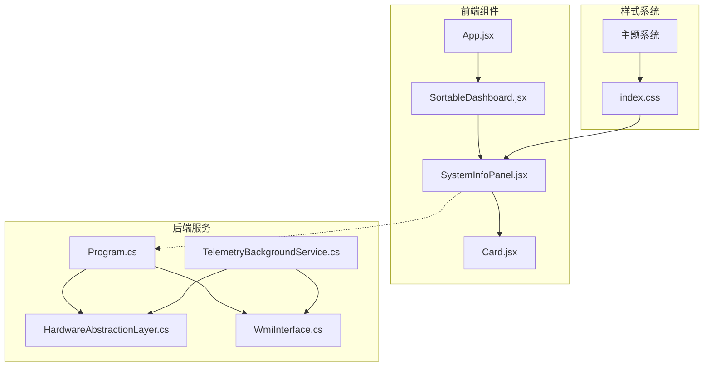

**图表来源**
- [SystemInfoPanel.jsx:1-59](file://src/components/panels/SystemInfoPanel.jsx#L1-L59)
- [Program.cs:10-143](file://server/api/Program.cs#L10-L143)
- [HardwareAbstractionLayer.cs:19-772](file://server/hal/HardwareAbstractionLayer.cs#L19-L772)

**章节来源**
- [SystemInfoPanel.jsx:1-59](file://src/components/panels/SystemInfoPanel.jsx#L1-L59)
- [Program.cs:10-143](file://server/api/Program.cs#L10-L143)

## 核心组件

系统信息面板由多个精心设计的组件构成，每个组件都有明确的职责和功能：

### 主要组件架构

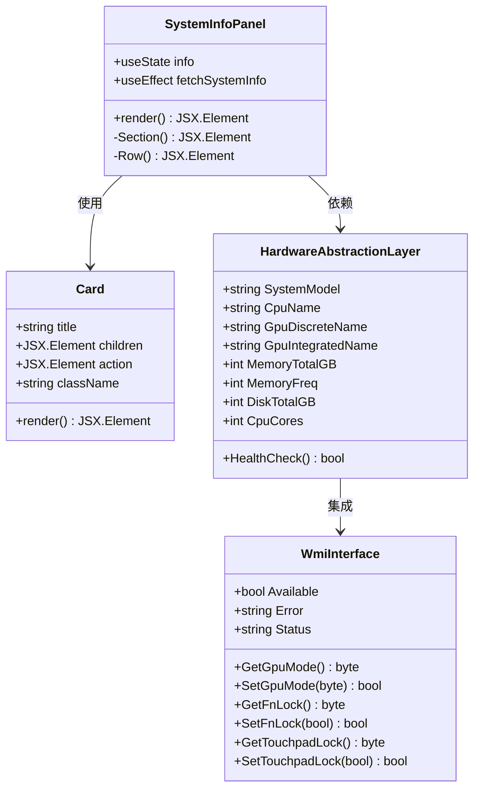

**图表来源**
- [SystemInfoPanel.jsx:4-59](file://src/components/panels/SystemInfoPanel.jsx#L4-L59)
- [Card.jsx:1-18](file://src/components/ui/Card.jsx#L1-L18)
- [HardwareAbstractionLayer.cs:456-574](file://server/hal/HardwareAbstractionLayer.cs#L456-L574)
- [WmiInterface.cs:18-48](file://server/api/WmiInterface.cs#L18-L48)

### 数据流架构

系统信息面板的数据流遵循清晰的层次结构：

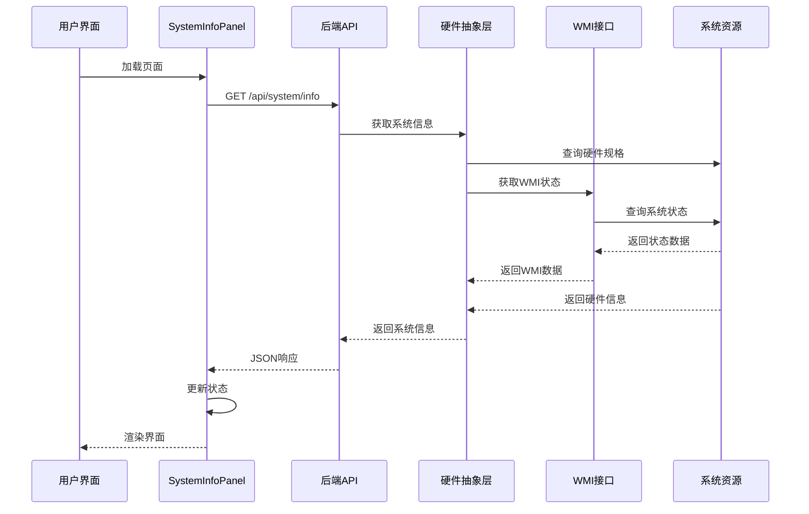

**图表来源**
- [SystemInfoPanel.jsx:7-12](file://src/components/panels/SystemInfoPanel.jsx#L7-L12)
- [Program.cs:121-135](file://server/api/Program.cs#L121-L135)
- [HardwareAbstractionLayer.cs:456-574](file://server/hal/HardwareAbstractionLayer.cs#L456-L574)

**章节来源**
- [SystemInfoPanel.jsx:4-59](file://src/components/panels/SystemInfoPanel.jsx#L4-L59)
- [Card.jsx:1-18](file://src/components/ui/Card.jsx#L1-L18)

## 架构概览

系统信息面板采用分层架构设计，确保了良好的可维护性和扩展性：

### 技术栈架构

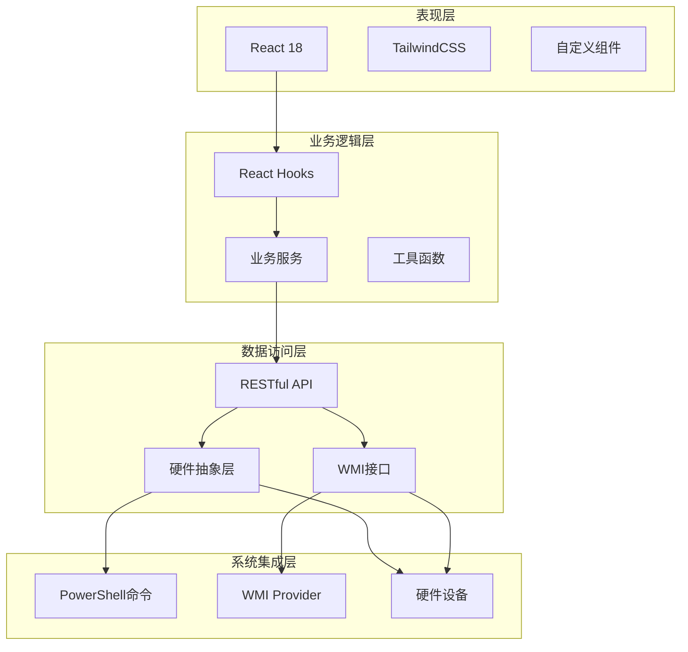

**图表来源**
- [Program.cs:10-14](file://server/api/Program.cs#L10-L14)
- [HardwareAbstractionLayer.cs:48-54](file://server/hal/HardwareAbstractionLayer.cs#L48-L54)
- [WmiInterface.cs:24-44](file://server/api/WmiInterface.cs#L24-L44)

### 系统信息获取流程

系统信息的获取过程涉及多个层次的数据采集和处理：

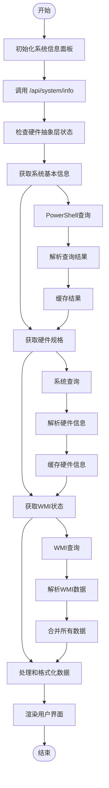

**图表来源**
- [Program.cs:121-135](file://server/api/Program.cs#L121-L135)
- [HardwareAbstractionLayer.cs:456-574](file://server/hal/HardwareAbstractionLayer.cs#L456-L574)
- [WmiInterface.cs:63-87](file://server/api/WmiInterface.cs#L63-L87)

**章节来源**
- [Program.cs:121-135](file://server/api/Program.cs#L121-L135)
- [HardwareAbstractionLayer.cs:456-574](file://server/hal/HardwareAbstractionLayer.cs#L456-L574)

## 详细组件分析

### SystemInfoPanel 组件

SystemInfoPanel 是系统信息面板的核心组件，负责获取和展示系统硬件信息。

#### 组件结构分析

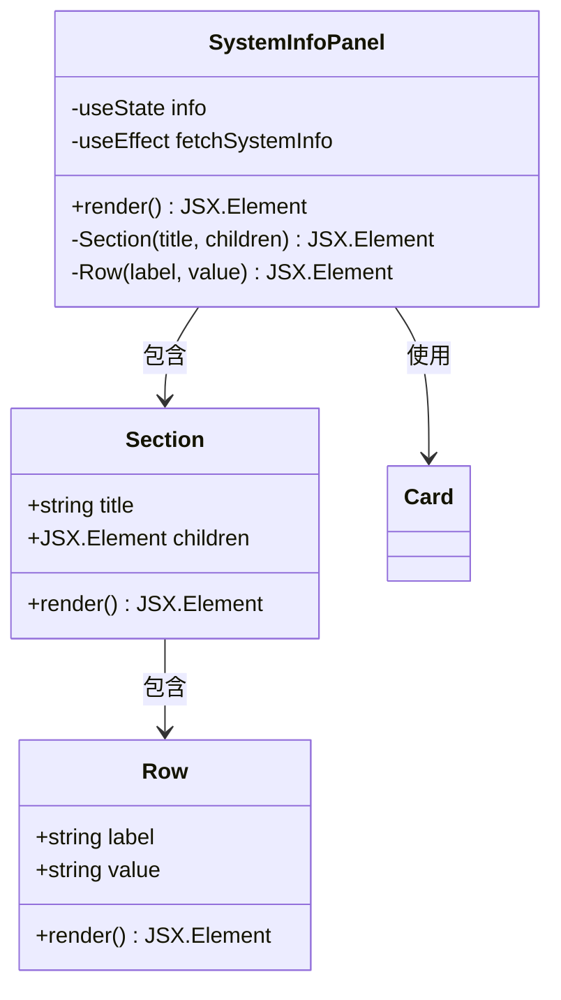

**图表来源**
- [SystemInfoPanel.jsx:4-59](file://src/components/panels/SystemInfoPanel.jsx#L4-L59)

#### 数据获取机制

组件使用 React 的 useEffect Hook 来获取系统信息：

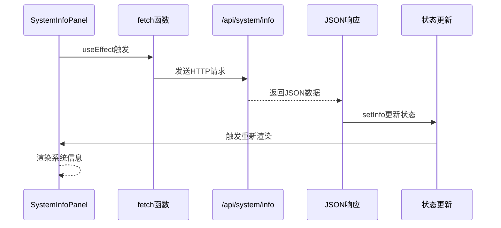

**图表来源**
- [SystemInfoPanel.jsx:7-12](file://src/components/panels/SystemInfoPanel.jsx#L7-L12)

#### 错误处理机制

组件实现了健壮的错误处理机制：

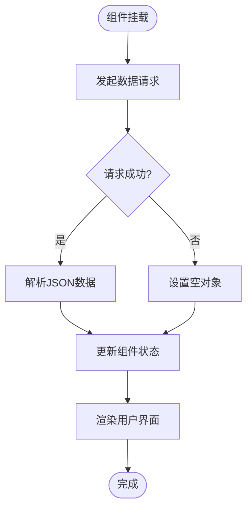

**图表来源**
- [SystemInfoPanel.jsx:11](file://src/components/panels/SystemInfoPanel.jsx#L11)

**章节来源**
- [SystemInfoPanel.jsx:4-59](file://src/components/panels/SystemInfoPanel.jsx#L4-L59)

### 硬件抽象层 (HAL)

HardwareAbstractionLayer 提供了统一的硬件访问接口，封装了底层硬件的具体实现细节。

#### 系统信息获取方法

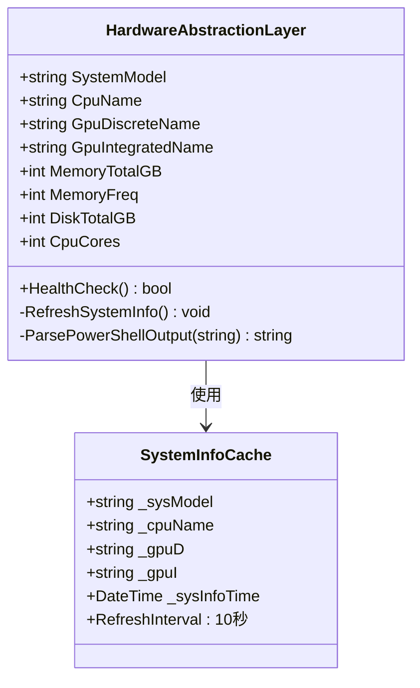

**图表来源**
- [HardwareAbstractionLayer.cs:38-42](file://server/hal/HardwareAbstractionLayer.cs#L38-L42)

#### 系统信息缓存策略

硬件抽象层实现了智能缓存机制来优化性能：

| 缓存类型 | 缓存间隔 | 缓存键 | 缓存价值 |
|---------|---------|-------|---------|
| 系统信息 | 10秒 | _sysInfoTime | 减少PowerShell调用频率 |
| CPU使用率 | 2秒 | _sgCpuTime | 平滑CPU使用率显示 |
| 内存使用率 | 2秒 | _sgMemTime | 减少内存查询开销 |
| 磁盘使用率 | 5秒 | _sgDiskTime | 降低磁盘查询频率 |
| GPU信息 | 2秒 | _sgGpuTime | 平滑GPU数据更新 |

**章节来源**
- [HardwareAbstractionLayer.cs:25-42](file://server/hal/HardwareAbstractionLayer.cs#L25-L42)
- [HardwareAbstractionLayer.cs:456-574](file://server/hal/HardwareAbstractionLayer.cs#L456-L574)

### WMI 接口集成

WmiInterface 提供了与 Windows Management Instrumentation 的直接集成，允许访问底层系统状态。

#### WMI 方法分类

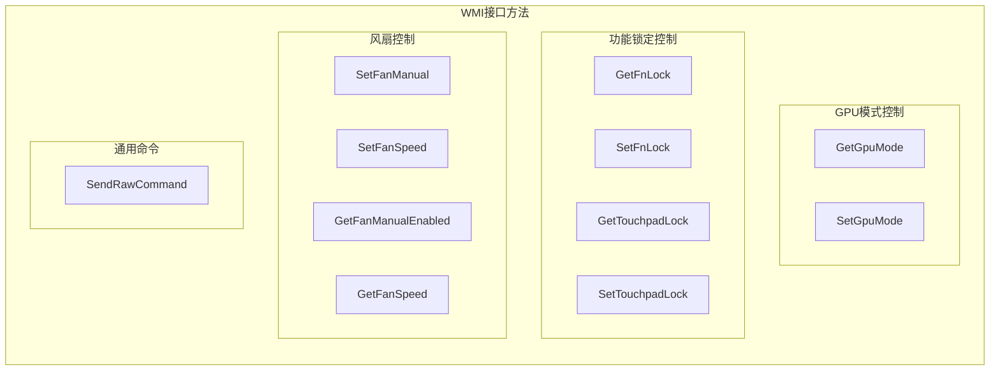

**图表来源**
- [WmiInterface.cs:63-87](file://server/api/WmiInterface.cs#L63-L87)
- [WmiInterface.cs:114-135](file://server/api/WmiInterface.cs#L114-L135)
- [WmiInterface.cs:155-169](file://server/api/WmiInterface.cs#L155-L169)
- [WmiInterface.cs:201-208](file://server/api/WmiInterface.cs#L201-L208)

#### WMI 状态管理

WMI 接口实现了状态检测和错误处理机制：

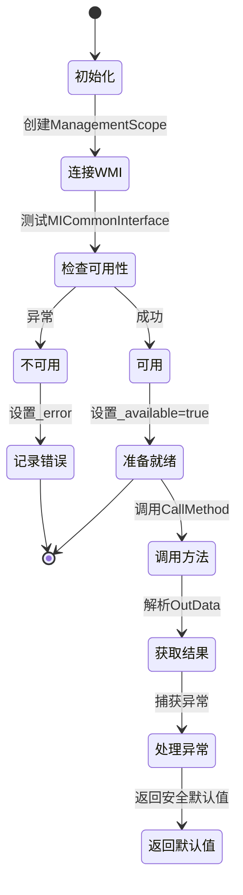

**图表来源**
- [WmiInterface.cs:24-44](file://server/api/WmiInterface.cs#L24-L44)

**章节来源**
- [WmiInterface.cs:18-48](file://server/api/WmiInterface.cs#L18-L48)
- [WmiInterface.cs:50-60](file://server/api/WmiInterface.cs#L50-L60)

### API 层设计

后端 API 层提供了统一的接口来访问系统信息和硬件状态。

#### API 端点设计

```mermaid
graph TB
subgraph "系统信息端点"
SystemInfo[/api/system/info]
HealthCheck[/api/health]
Discover[/api/discover]
end
subgraph "控制端点"
Control[/api/control]
FanControl[/api/fan/set-target]
FanRestore[/api/fan/restore]
WmiCmd[/api/wmi/cmd]
end
subgraph "查询端点"
Telemetry[/api/telemetry]
EcScan[/api/ec-scan]
SmuProbe[/api/smu/probe]
GpuStatus[/api/gpu/status]
end
subgraph "配置端点"
CustomParams[/api/custom-params]
UiState[/api/ui-state]
DefaultConfig[/api/default-config]
end
```

**图表来源**
- [Program.cs:121-135](file://server/api/Program.cs#L121-L135)
- [Program.cs:144-202](file://server/api/Program.cs#L144-L202)
- [Program.cs:213-237](file://server/api/Program.cs#L213-L237)

#### 数据格式化处理

API 层实现了统一的数据格式化和类型转换：

| 字段名 | 输入类型 | 处理逻辑 | 输出类型 |
|--------|----------|----------|----------|
| cpuFreq | float | 四舍五入到1位小数 | double |
| gpuMode | byte | 转换为字符串 | string/null |
| fnLock/touchpadLock | byte | 0/1转换为布尔值 | bool |
| memoryTotalGB | long | 转换为GB单位 | int |
| diskTotalGB | long | 转换为GB单位 | int |

**章节来源**
- [Program.cs:121-135](file://server/api/Program.cs#L121-L135)
- [Program.cs:87-120](file://server/api/Program.cs#L87-L120)

## 依赖关系分析

系统信息面板的依赖关系体现了清晰的分层架构设计。

### 前端依赖关系

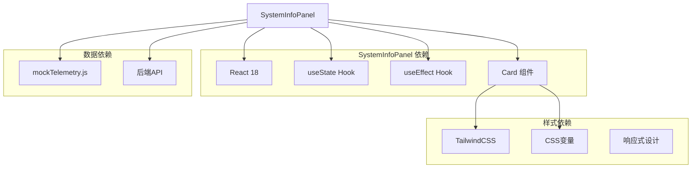

**图表来源**
- [SystemInfoPanel.jsx:1-2](file://src/components/panels/SystemInfoPanel.jsx#L1-L2)
- [Card.jsx:1-18](file://src/components/ui/Card.jsx#L1-L18)
- [mockTelemetry.js:1-22](file://src/data/mockTelemetry.js#L1-L22)

### 后端依赖关系

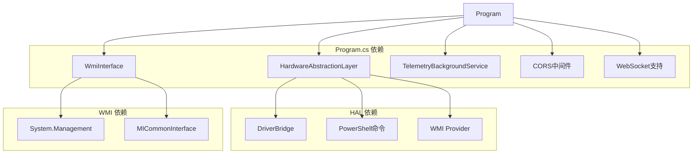

**图表来源**
- [Program.cs:10-14](file://server/api/Program.cs#L10-L14)
- [HardwareAbstractionLayer.cs:48-54](file://server/hal/HardwareAbstractionLayer.cs#L48-L54)
- [WmiInterface.cs:14-16](file://server/api/WmiInterface.cs#L14-L16)

**章节来源**
- [Program.cs:10-14](file://server/api/Program.cs#L10-L14)
- [HardwareAbstractionLayer.cs:48-54](file://server/hal/HardwareAbstractionLayer.cs#L48-L54)

## 性能考虑

系统信息面板在设计时充分考虑了性能优化，采用了多种策略来确保流畅的用户体验。

### 缓存策略

硬件抽象层实现了多层次的缓存机制：

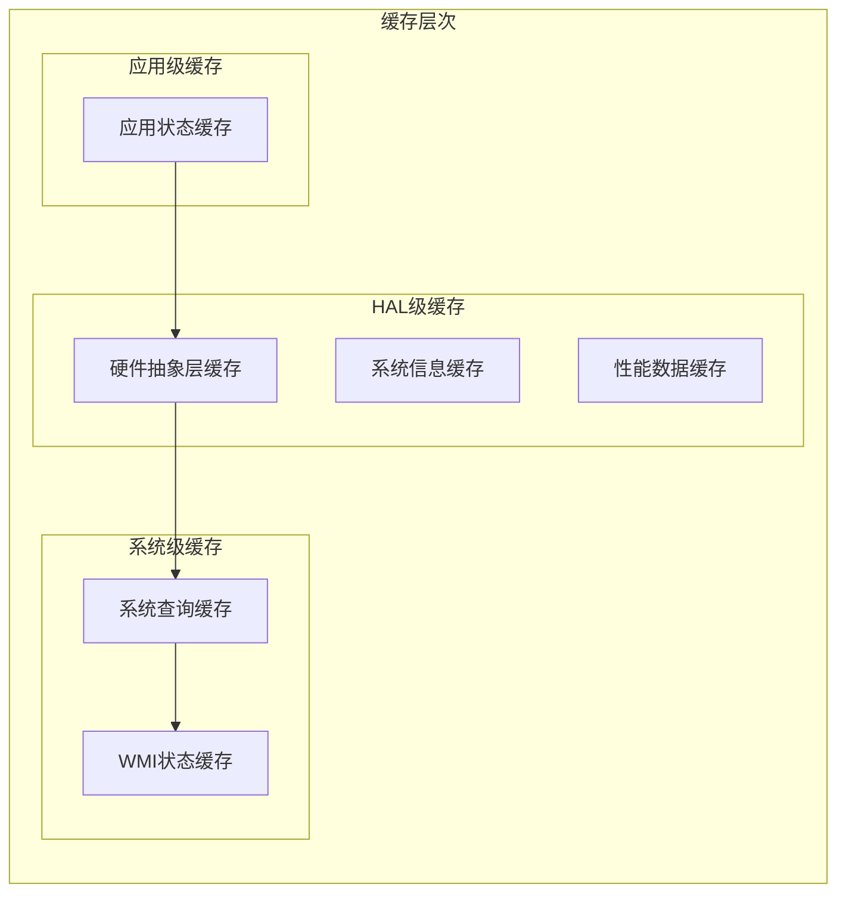

**图表来源**
- [HardwareAbstractionLayer.cs:25-42](file://server/hal/HardwareAbstractionLayer.cs#L25-L42)

### 查询优化

系统信息面板采用了智能的查询优化策略：

| 查询类型 | 缓存间隔 | 优化策略 | 性能收益 |
|----------|----------|----------|----------|
| 系统信息 | 10秒 | PowerShell查询缓存 | 减少系统调用次数 |
| CPU使用率 | 2秒 | 遥测数据缓存 | 平滑数据更新 |
| 内存使用率 | 2秒 | 内存查询缓存 | 降低查询频率 |
| 磁盘使用率 | 5秒 | 磁盘扫描缓存 | 减少磁盘I/O |
| GPU信息 | 2秒 | GPU查询缓存 | 提升响应速度 |

### 内存管理

组件实现了高效的内存管理策略：

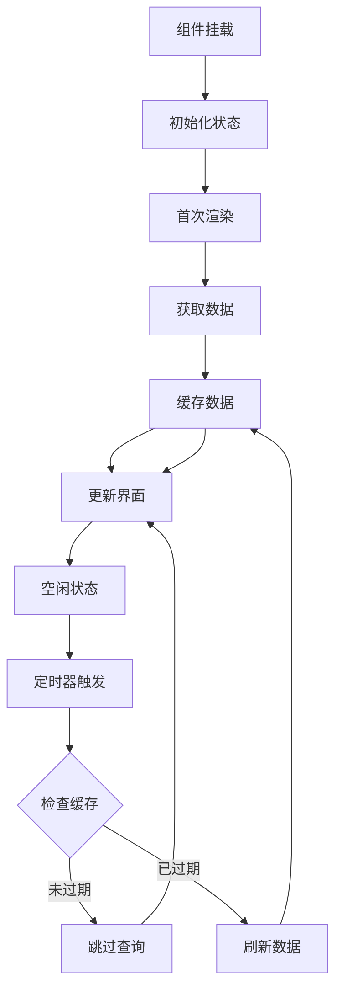

**图表来源**
- [SystemInfoPanel.jsx:7-12](file://src/components/panels/SystemInfoPanel.jsx#L7-L12)

**章节来源**
- [HardwareAbstractionLayer.cs:25-42](file://server/hal/HardwareAbstractionLayer.cs#L25-L42)
- [SystemInfoPanel.jsx:7-12](file://src/components/panels/SystemInfoPanel.jsx#L7-L12)

## 故障排除指南

系统信息面板实现了完善的错误处理和故障排除机制。

### 常见问题诊断

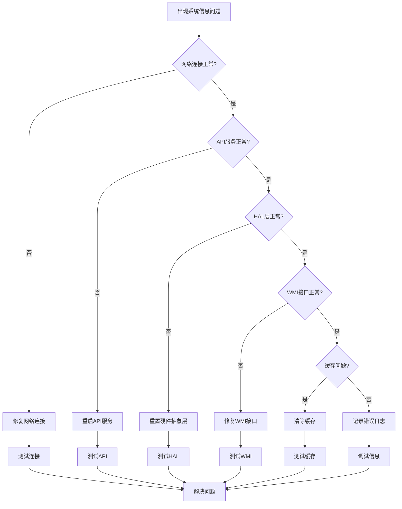

**图表来源**
- [SystemInfoPanel.jsx:11](file://src/components/panels/SystemInfoPanel.jsx#L11)
- [HardwareAbstractionLayer.cs:754-765](file://server/hal/HardwareAbstractionLayer.cs#L754-L765)

### 错误处理策略

系统信息面板采用了多层错误处理策略：

| 错误类型 | 处理策略 | 用户反馈 | 恢复机制 |
|----------|----------|----------|----------|
| 网络错误 | 降级到空状态 | 显示"加载中..." | 自动重试 |
| API错误 | 返回空对象 | 显示占位符 | 重试请求 |
| HAL错误 | 使用默认值 | 显示默认值 | 重置HAL |
| WMI错误 | 回退到HAL | 显示可用信息 | 重试WMI |
| 缓存错误 | 清除缓存 | 重新加载 | 重建缓存 |

### 调试和监控

系统提供了丰富的调试和监控功能：

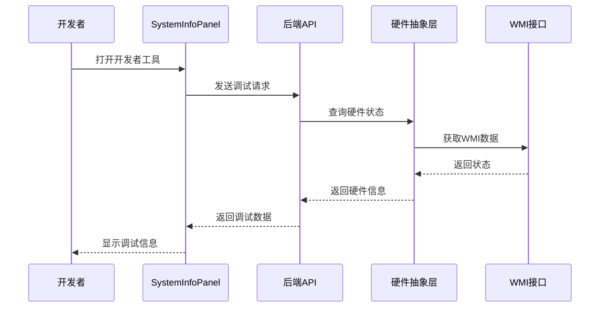

**图表来源**
- [Program.cs:687-691](file://server/api/Program.cs#L687-L691)

**章节来源**
- [SystemInfoPanel.jsx:11](file://src/components/panels/SystemInfoPanel.jsx#L11)
- [HardwareAbstractionLayer.cs:754-765](file://server/hal/HardwareAbstractionLayer.cs#L754-L765)

## 结论

系统信息面板是一个设计精良、功能完备的系统监控组件。它成功地将复杂的硬件信息抽象为简洁易懂的用户界面，同时保持了高度的可扩展性和可维护性。

### 主要优势

1. **模块化设计**：清晰的组件分离和职责划分
2. **性能优化**：智能缓存和查询优化策略
3. **错误处理**：健壮的错误处理和降级机制
4. **可扩展性**：易于添加新功能和自定义选项
5. **用户体验**：直观的界面设计和响应式布局

### 技术亮点

- **前后端分离**：现代化的技术栈和架构设计
- **硬件抽象**：统一的硬件访问接口
- **实时监控**：WebSocket实时数据推送
- **多主题支持**：灵活的主题切换机制
- **跨平台兼容**：Windows平台的深度集成

### 改进建议

1. **国际化支持**：添加多语言本地化功能
2. **数据导出**：支持系统信息导出功能
3. **自定义布局**：允许用户自定义信息面板布局
4. **历史数据**：添加系统信息历史记录功能
5. **通知系统**：实现系统状态变更通知机制

系统信息面板为用户提供了全面的系统洞察，是 DOUZHANZHE-Control 项目中不可或缺的重要组成部分。