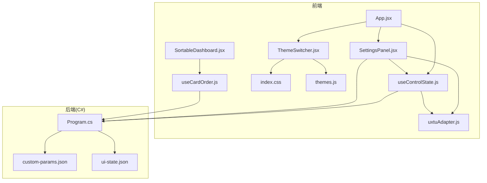
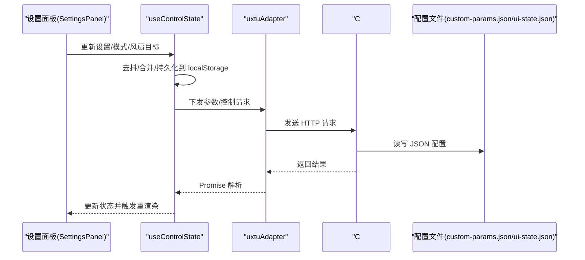
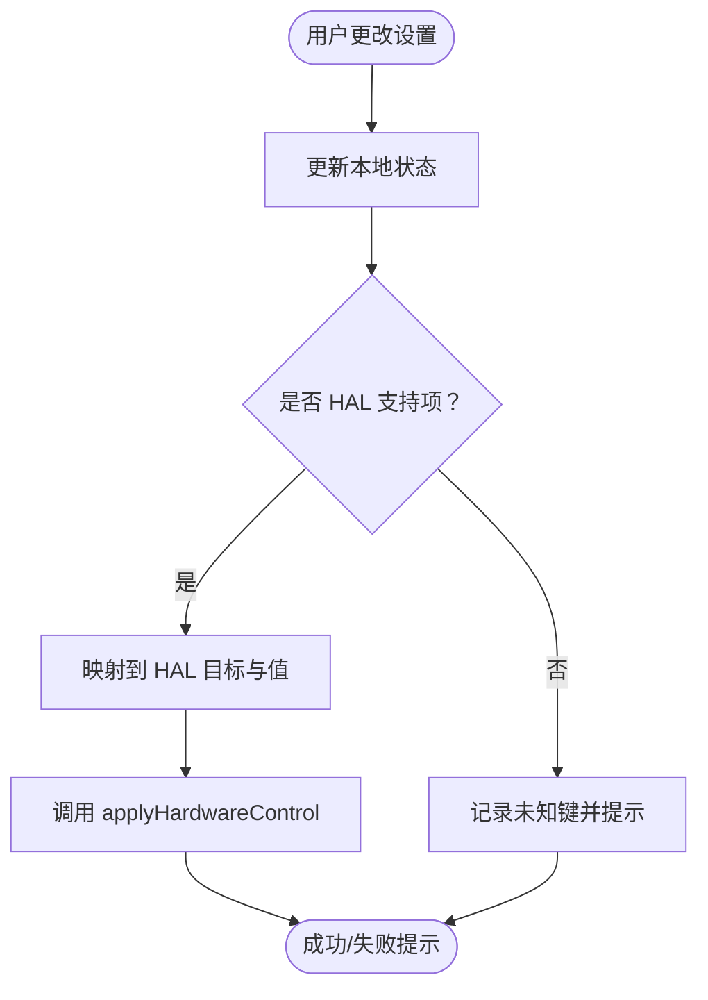
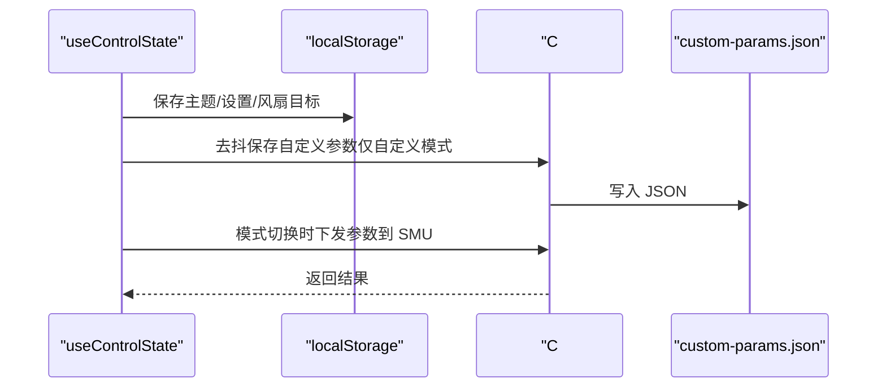
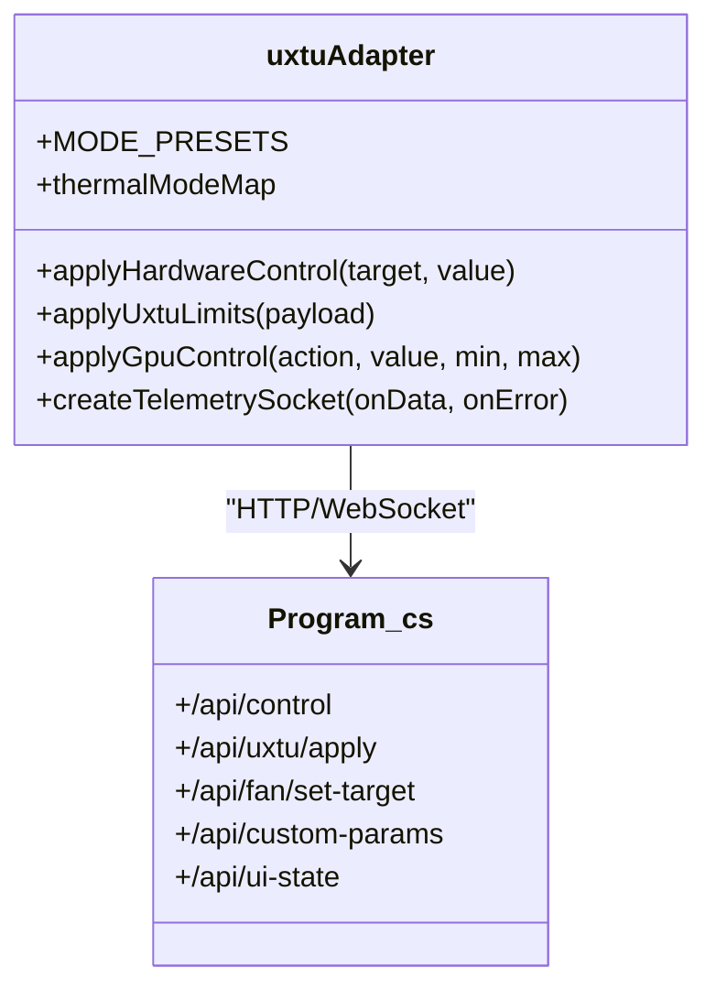
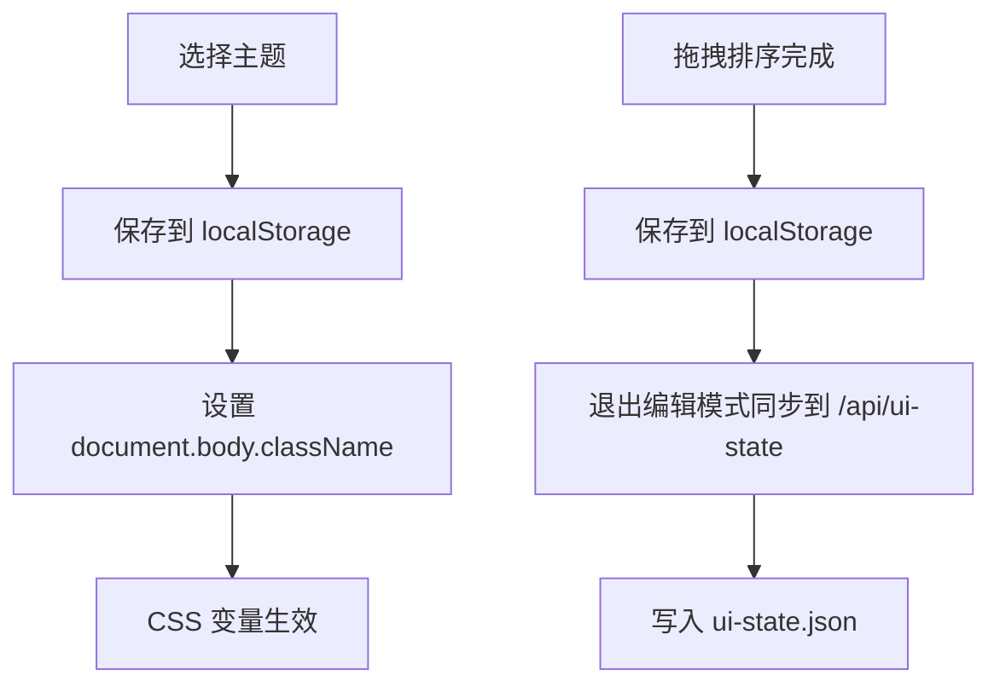
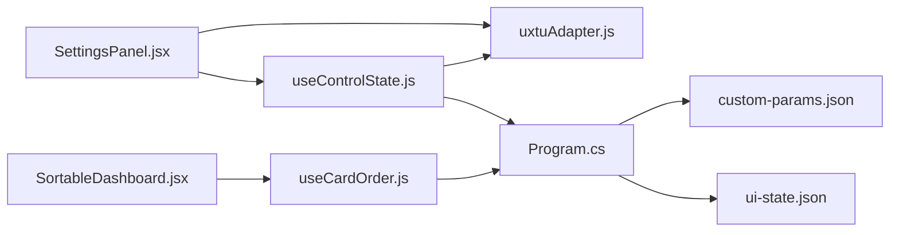

# 设置面板

<cite>
**本文档引用的文件**
- [SettingsPanel.jsx](file://src/components/panels/SettingsPanel.jsx)
- [useControlState.js](file://src/hooks/useControlState.js)
- [uxtuAdapter.js](file://src/services/uxtuAdapter.js)
- [Program.cs](file://server/api/Program.cs)
- [custom-params.json](file://server/api/config/custom-params.json)
- [ui-state.json](file://server/api/config/ui-state.json)
- [themes.js](file://src/data/themes.js)
- [App.jsx](file://src/App.jsx)
- [SortableDashboard.jsx](file://src/components/SortableDashboard.jsx)
- [useCardOrder.js](file://src/hooks/useCardOrder.js)
- [ThemeSwitcher.jsx](file://src/components/ThemeSwitcher.jsx)
- [index.css](file://src/index.css)
</cite>

## 目录
1. [简介](#简介)
2. [项目结构](#项目结构)
3. [核心组件](#核心组件)
4. [架构总览](#架构总览)
5. [详细组件分析](#详细组件分析)
6. [依赖关系分析](#依赖关系分析)
7. [性能考量](#性能考量)
8. [故障排查指南](#故障排查指南)
9. [结论](#结论)
10. [附录](#附录)

## 简介
本文件面向“设置面板”的配置管理能力，系统性阐述以下方面：
- 系统选项设置：包括系统开关（如锁键、散热模式、电源计划）、开机自启动与最小化偏好、键盘背光亮度等。
- 界面偏好配置：主题切换、仪表盘卡片排序与可见性管理。
- 用户行为定制：模式选择与参数记忆、风扇目标转速控制、自定义参数持久化与下发。
- 数据持久化机制：本地存储（localStorage）与服务端配置文件（JSON）双轨持久化。
- 实时生效机制：去抖与即时下发策略、WebSocket 遥测回退模拟。
- 配置验证与回滚：服务端参数校验、模式切换回退、预设恢复。
- 与其他系统组件集成：主题切换、开机自启动、通知提示、SMU/GPU/风扇控制。

## 项目结构
设置面板位于前端 React 组件树中，通过自定义 Hook 管理全局状态，并与 C# 后端 API 交互完成硬件控制与配置持久化。



**图表来源**
- [App.jsx:23-133](file://src/App.jsx#L23-L133)
- [SettingsPanel.jsx:1-124](file://src/components/panels/SettingsPanel.jsx#L1-L124)
- [useControlState.js:1-355](file://src/hooks/useControlState.js#L1-L355)
- [uxtuAdapter.js:1-130](file://src/services/uxtuAdapter.js#L1-L130)
- [Program.cs:1-783](file://server/api/Program.cs#L1-L783)
- [custom-params.json:1-22](file://server/api/config/custom-params.json#L1-L22)
- [ui-state.json:1-17](file://server/api/config/ui-state.json#L1-L17)

**章节来源**
- [App.jsx:23-133](file://src/App.jsx#L23-L133)
- [SettingsPanel.jsx:1-124](file://src/components/panels/SettingsPanel.jsx#L1-L124)
- [useControlState.js:1-355](file://src/hooks/useControlState.js#L1-L355)
- [uxtuAdapter.js:1-130](file://src/services/uxtuAdapter.js#L1-L130)
- [Program.cs:1-783](file://server/api/Program.cs#L1-L783)

## 核心组件
- 设置面板组件：负责渲染系统开关、开机自启动、键盘背光等 UI，并发起后端请求。
- 控制状态 Hook：统一管理主题、设置、自定义参数、风扇目标转速、模式切换与持久化策略。
- 适配器层：封装后端 API 请求（硬件控制、SMU/GPU/风扇、遥测等），并提供模式预设映射。
- 主题系统：主题切换器与多套 CSS 变量主题，持久化到 localStorage 并同步到 DOM。
- UI 状态管理：仪表盘卡片排序与隐藏列表，持久化至 localStorage 与服务端。

**章节来源**
- [SettingsPanel.jsx:1-124](file://src/components/panels/SettingsPanel.jsx#L1-L124)
- [useControlState.js:1-355](file://src/hooks/useControlState.js#L1-L355)
- [uxtuAdapter.js:1-130](file://src/services/uxtuAdapter.js#L1-L130)
- [ThemeSwitcher.jsx:1-23](file://src/components/ThemeSwitcher.jsx#L1-L23)
- [themes.js:1-34](file://src/data/themes.js#L1-L34)
- [index.css:1-250](file://src/index.css#L1-L250)
- [SortableDashboard.jsx:1-214](file://src/components/SortableDashboard.jsx#L1-L214)
- [useCardOrder.js:1-48](file://src/hooks/useCardOrder.js#L1-L48)

## 架构总览
设置面板的配置管理采用“前端状态 + 后端 API + 本地/服务端持久化”的三层架构：
- 前端状态：React 状态与 localStorage，保证页面刷新不丢失。
- 后端 API：C# Web API 提供硬件控制、参数持久化、UI 状态同步、开机自启动管理。
- 配置文件：JSON 文件（自定义参数、UI 状态）由后端读写，确保跨会话一致性。



**图表来源**
- [SettingsPanel.jsx:1-124](file://src/components/panels/SettingsPanel.jsx#L1-L124)
- [useControlState.js:1-355](file://src/hooks/useControlState.js#L1-L355)
- [uxtuAdapter.js:1-130](file://src/services/uxtuAdapter.js#L1-L130)
- [Program.cs:538-568](file://server/api/Program.cs#L538-L568)
- [custom-params.json:1-22](file://server/api/config/custom-params.json#L1-L22)
- [ui-state.json:1-17](file://server/api/config/ui-state.json#L1-L17)

## 详细组件分析

### 设置面板组件（SettingsPanel）
职责与特性：
- 渲染系统开关（数字键锁定、大写锁定、触摸板锁定、Fn 锁定）。
- 渲染开机自启动与最小化偏好开关，并与后端 /api/auto-start、/api/auto-start-opts 对接。
- 提供键盘背光滑条（0-3），并支持 OSD 关闭提示。
- 通过 HAL 映射将设置项转换为后端控制指令，实现即时生效。

关键流程（切换设置项）：
- 更新本地状态（React setState）。
- 若为 HAL 支持项，则调用硬件控制接口；否则忽略或提示。



**图表来源**
- [SettingsPanel.jsx:49-73](file://src/components/panels/SettingsPanel.jsx#L49-L73)

**章节来源**
- [SettingsPanel.jsx:1-124](file://src/components/panels/SettingsPanel.jsx#L1-L124)

### 控制状态 Hook（useControlState）
职责与特性：
- 主题与设置持久化：localStorage 记录主题与设置对象。
- 自定义参数持久化：仅在“自定义模式”下保存到服务端 custom-params.json，并带去抖（1 秒）。
- 模式切换：保存当前模式参数到 localStorage，加载新模式记忆或预设，并自动下发到 SMU。
- 风扇目标转速：localStorage 记录，去抖（600ms）后调用 /api/fan/set-target。
- 电压偏移：无论模式如何均持久化到 localStorage。
- 遥测回退：后端不可用时，使用 mock 数据与物理模型推演。

持久化与去抖策略：
- 自定义参数保存：paramsLoaded 标记服务端参数加载完成后再保存；仅当 settings.mode === "custom" 时保存。
- 风扇目标转速保存：每次变更立即保存 localStorage，并延时请求后端。
- 模式切换：保存旧模式参数到 localStorage；加载新模式参数或预设；必要时自动下发。



**图表来源**
- [useControlState.js:144-169](file://src/hooks/useControlState.js#L144-L169)
- [Program.cs:538-552](file://server/api/Program.cs#L538-L552)

**章节来源**
- [useControlState.js:1-355](file://src/hooks/useControlState.js#L1-L355)

### 适配器层（uxtuAdapter）
职责与特性：
- 硬件控制：将前端设置项映射到 HAL 控制目标（如 kb_light、fn_lock、thermal_mode 等）。
- SMU/GPU 控制：封装 /api/uxtu/apply、/api/gpu/set、/api/fan/set-target 等。
- 模式预设：提供 MODE_PRESETS 与热模式映射，便于一键下发。
- WebSocket 遥测：直连本地 3100 端口获取实时遥测数据。



**图表来源**
- [uxtuAdapter.js:1-130](file://src/services/uxtuAdapter.js#L1-L130)
- [Program.cs:144-461](file://server/api/Program.cs#L144-L461)

**章节来源**
- [uxtuAdapter.js:1-130](file://src/services/uxtuAdapter.js#L1-L130)

### 主题与界面偏好
- 主题系统：ThemeSwitcher 读取 themes.js 的主题列表，切换时将主题类名写入 body，CSS 变量随之生效。
- UI 状态：SortableDashboard 使用 useCardOrder 管理卡片排序与隐藏，退出编辑模式时同步到服务端。
- 默认状态：ui-state.json 提供默认卡片顺序与隐藏列表，支持服务端读写。



**图表来源**
- [ThemeSwitcher.jsx:1-23](file://src/components/ThemeSwitcher.jsx#L1-L23)
- [themes.js:1-34](file://src/data/themes.js#L1-L34)
- [index.css:1-250](file://src/index.css#L1-L250)
- [useCardOrder.js:1-48](file://src/hooks/useCardOrder.js#L1-L48)
- [SortableDashboard.jsx:1-214](file://src/components/SortableDashboard.jsx#L1-L214)
- [Program.cs:553-568](file://server/api/Program.cs#L553-L568)

**章节来源**
- [ThemeSwitcher.jsx:1-23](file://src/components/ThemeSwitcher.jsx#L1-L23)
- [themes.js:1-34](file://src/data/themes.js#L1-L34)
- [index.css:1-250](file://src/index.css#L1-L250)
- [useCardOrder.js:1-48](file://src/hooks/useCardOrder.js#L1-L48)
- [SortableDashboard.jsx:1-214](file://src/components/SortableDashboard.jsx#L1-L214)

### 开机自启动与最小化偏好
- 查询与设置：/api/auto-start、/api/auto-start-opts。
- Windows 任务计划：启用时注册任务，按最小化偏好传参启动外壳程序；禁用则删除任务。
- 最小化偏好文件：auto-start-opts.json 由后端读写。

```mermaid
sequenceDiagram
participant UI as "设置面板"
participant API as "C# /api/auto-start*"
participant TS as "Windows 任务计划"
participant OPT as "auto-start-opts.json"
UI->>API : GET /api/auto-start
API-->>UI : { enabled }
UI->>API : POST /api/auto-start { enabled }
API->>TS : 注册/删除任务
UI->>API : POST /api/auto-start-opts { minimized }
API->>OPT : 写入最小化偏好
```

**图表来源**
- [SettingsPanel.jsx:12-48](file://src/components/panels/SettingsPanel.jsx#L12-L48)
- [Program.cs:621-686](file://server/api/Program.cs#L621-L686)
- [Program.cs:590-618](file://server/api/Program.cs#L590-L618)

**章节来源**
- [SettingsPanel.jsx:12-48](file://src/components/panels/SettingsPanel.jsx#L12-L48)
- [Program.cs:590-686](file://server/api/Program.cs#L590-L686)

### 配置验证与回滚策略
- 服务端参数校验：/api/uxtu/apply 对 CPU/GPU 功耗、温度墙、频率限制等进行校验与下发，返回错误码。
- 模式切换回退：若新参数下发失败，可回滚到上一模式记忆或预设。
- 预设恢复：一键恢复 MODE_PRESETS 或 localStorage 记忆值。
- UI 状态回退：服务端默认配置与本地配置冲突时，以服务端为准（优先顺序：服务端 > localStorage > 默认）。

**章节来源**
- [useControlState.js:223-240](file://src/hooks/useControlState.js#L223-L240)
- [Program.cs:463-494](file://server/api/Program.cs#L463-L494)

## 依赖关系分析
- 组件耦合：
  - SettingsPanel 依赖 uxtuAdapter 与 useControlState。
  - App.jsx 作为容器，注入主题、设置、参数与历史数据。
  - SortableDashboard 与 useCardOrder 依赖服务端 UI 状态接口。
- 外部依赖：
  - C# HAL：WMI、SMU、GPU 控制、风扇控制、遥测 WebSocket。
  - JSON 配置：custom-params.json、ui-state.json。



**图表来源**
- [SettingsPanel.jsx:1-124](file://src/components/panels/SettingsPanel.jsx#L1-L124)
- [useControlState.js:1-355](file://src/hooks/useControlState.js#L1-L355)
- [uxtuAdapter.js:1-130](file://src/services/uxtuAdapter.js#L1-L130)
- [Program.cs:538-568](file://server/api/Program.cs#L538-L568)
- [SortableDashboard.jsx:1-214](file://src/components/SortableDashboard.jsx#L1-L214)
- [useCardOrder.js:1-48](file://src/hooks/useCardOrder.js#L1-L48)

**章节来源**
- [SettingsPanel.jsx:1-124](file://src/components/panels/SettingsPanel.jsx#L1-L124)
- [useControlState.js:1-355](file://src/hooks/useControlState.js#L1-L355)
- [uxtuAdapter.js:1-130](file://src/services/uxtuAdapter.js#L1-L130)
- [Program.cs:538-568](file://server/api/Program.cs#L538-L568)
- [SortableDashboard.jsx:1-214](file://src/components/SortableDashboard.jsx#L1-L214)
- [useCardOrder.js:1-48](file://src/hooks/useCardOrder.js#L1-L48)

## 性能考量
- 去抖优化：风扇目标转速（600ms）、自定义参数保存（1000ms）降低网络与硬件压力。
- 本地优先：主题与设置直接读写 localStorage，减少首屏等待。
- 遥测回退：后端不可用时使用 mock 数据与物理模型，保证体验连续性。
- 模式切换：仅在必要时下发参数，避免重复写入。

## 故障排查指南
- 硬件控制失败：
  - 检查 HAL 映射与目标值范围（如 kb_light 0-3）。
  - 查看后端返回状态与异常日志。
- 自定义参数保存失败：
  - 确认当前模式为“自定义”，且 paramsLoaded 已完成。
  - 检查服务端 JSON 写入权限与磁盘空间。
- 开机自启动无效：
  - 确认任务计划已注册，外壳程序路径正确。
  - 检查最小化偏好是否符合预期。
- UI 排序不同步：
  - 确认退出编辑模式后已触发同步。
  - 检查 /api/ui-state 是否返回成功。

**章节来源**
- [SettingsPanel.jsx:23-48](file://src/components/panels/SettingsPanel.jsx#L23-L48)
- [useControlState.js:144-169](file://src/hooks/useControlState.js#L144-L169)
- [Program.cs:538-552](file://server/api/Program.cs#L538-L552)
- [Program.cs:621-686](file://server/api/Program.cs#L621-L686)
- [Program.cs:553-568](file://server/api/Program.cs#L553-L568)

## 结论
设置面板通过“前端状态 + 后端 API + 本地/服务端持久化”的设计，实现了系统选项、界面偏好与用户行为的全面配置管理。其去抖策略、模式记忆与回退机制保障了稳定性与可用性；与 HAL、SMU、WMI 的深度集成提供了强大的硬件控制能力。建议在扩展新配置项时遵循既有模式（去抖、映射、持久化、回退）以保持一致体验。

## 附录

### 配置项与持久化一览
- 系统开关：numLock、capsLock、touchpadLock、fnLock、dGpuDirect、gpuOnly、osdDisabled（部分不支持即时生效）。
- 风扇目标转速：largeRpm、smallRpm（localStorage + 去抖请求）。
- 自定义参数：cpuLongPptW、gpuPptLimitW、tempLimitC 等（仅自定义模式保存到服务端）。
- UI 状态：cardOrder、hiddenCards（localStorage + 服务端）。
- 主题：theme（localStorage + DOM 类名）。

**章节来源**
- [SettingsPanel.jsx:49-73](file://src/components/panels/SettingsPanel.jsx#L49-L73)
- [useControlState.js:109-169](file://src/hooks/useControlState.js#L109-L169)
- [Program.cs:538-568](file://server/api/Program.cs#L538-L568)
- [custom-params.json:1-22](file://server/api/config/custom-params.json#L1-L22)
- [ui-state.json:1-17](file://server/api/config/ui-state.json#L1-L17)

### 实际代码示例（路径指引）
- 配置项管理（设置面板）：[SettingsPanel.jsx:49-73](file://src/components/panels/SettingsPanel.jsx#L49-L73)
- 设置变更与 HAL 下发：[SettingsPanel.jsx:65-70](file://src/components/panels/SettingsPanel.jsx#L65-L70)
- 自定义参数保存（去抖）：[useControlState.js:144-169](file://src/hooks/useControlState.js#L144-L169)
- 模式切换与参数下发：[useControlState.js:193-240](file://src/hooks/useControlState.js#L193-L240)
- 硬件控制适配器：[uxtuAdapter.js:36-44](file://src/services/uxtuAdapter.js#L36-L44)
- SMU/GPU/风扇控制：[uxtuAdapter.js:19-88](file://src/services/uxtuAdapter.js#L19-L88)
- 服务端参数持久化：[Program.cs:542-552](file://server/api/Program.cs#L542-L552)
- UI 状态持久化：[Program.cs:557-568](file://server/api/Program.cs#L557-L568)
- 开机自启动管理：[Program.cs:621-686](file://server/api/Program.cs#L621-L686)