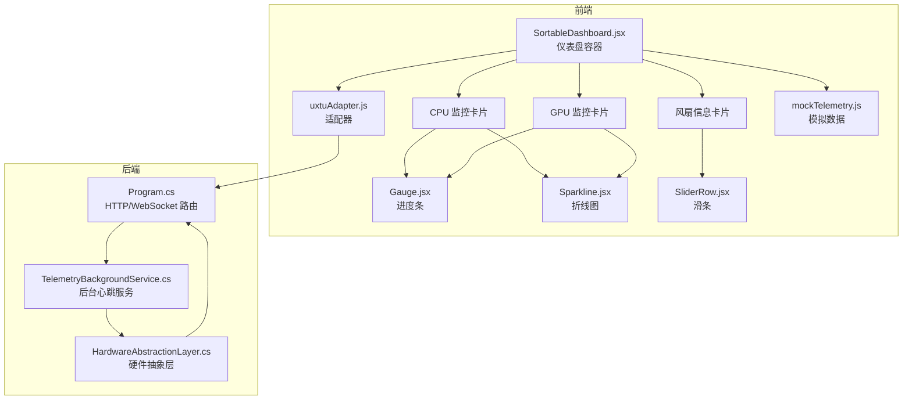
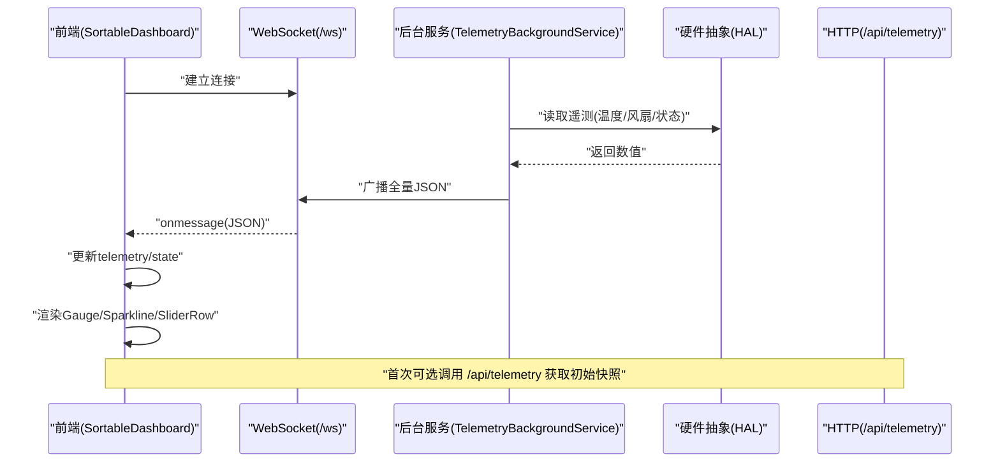
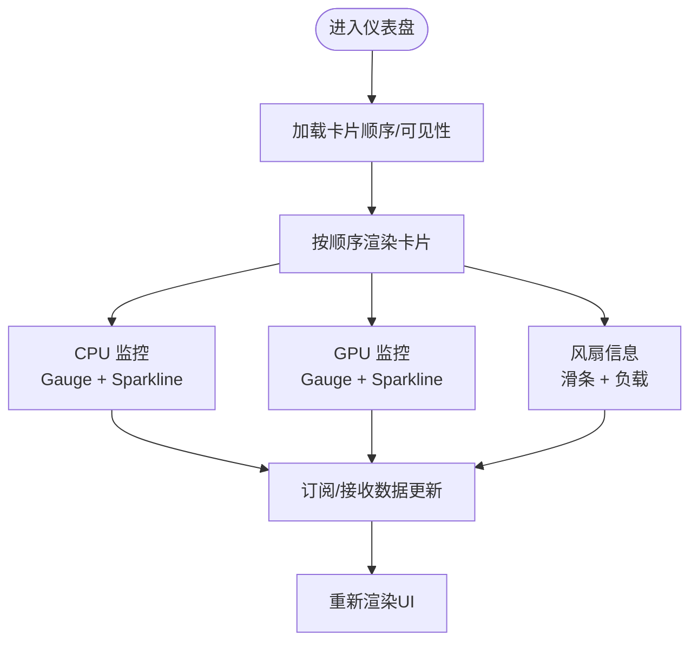
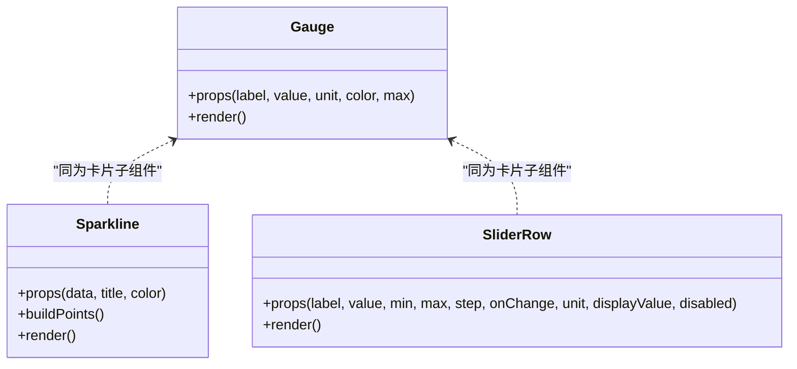
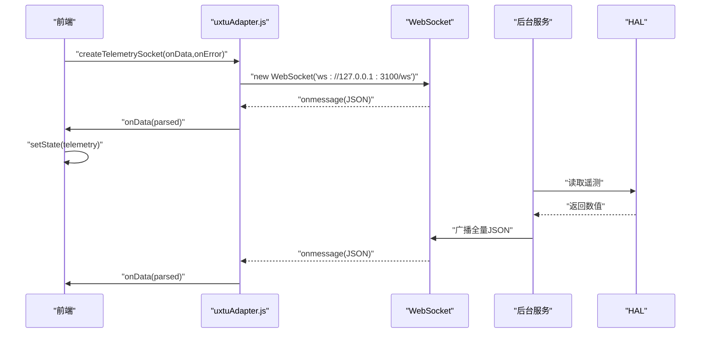
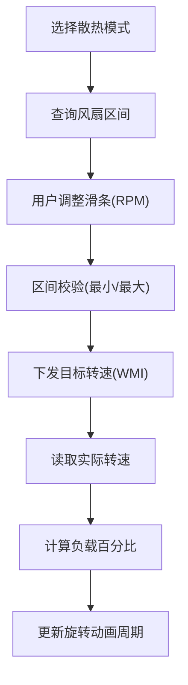
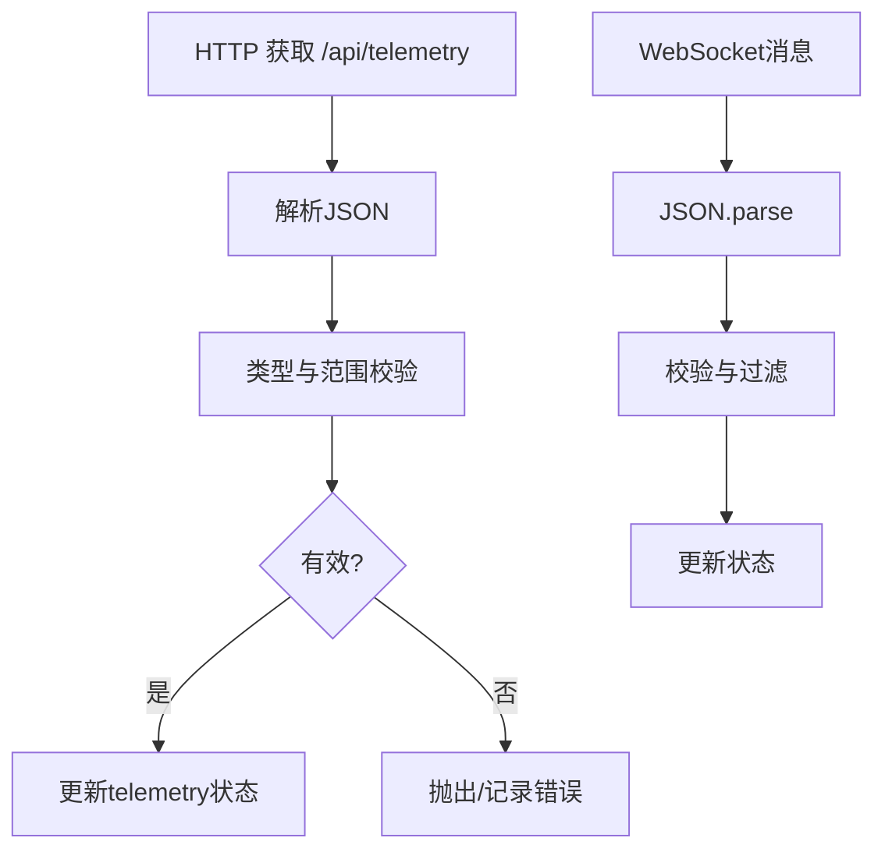
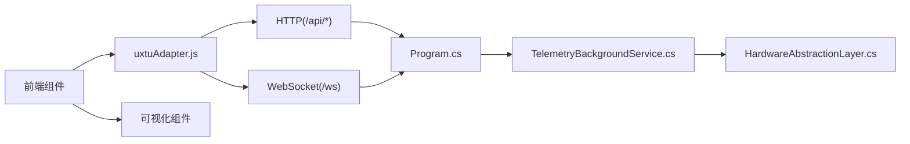

# 遥测面板

<cite>
**本文档引用的文件**
- [TelemetryPanel.jsx](file://src/components/panels/TelemetryPanel.jsx)
- [SortableDashboard.jsx](file://src/components/SortableDashboard.jsx)
- [Gauge.jsx](file://src/components/ui/Gauge.jsx)
- [Sparkline.jsx](file://src/components/ui/Sparkline.jsx)
- [SliderRow.jsx](file://src/components/ui/SliderRow.jsx)
- [uxtuAdapter.js](file://src/services/uxtuAdapter.js)
- [mockTelemetry.js](file://src/data/mockTelemetry.js)
- [Program.cs](file://server/api/Program.cs)
- [TelemetryBackgroundService.cs](file://server/api/TelemetryBackgroundService.cs)
- [HardwareAbstractionLayer.cs](file://server/hal/HardwareAbstractionLayer.cs)
</cite>

## 目录
1. [简介](#简介)
2. [项目结构](#项目结构)
3. [核心组件](#核心组件)
4. [架构总览](#架构总览)
5. [详细组件分析](#详细组件分析)
6. [依赖关系分析](#依赖关系分析)
7. [性能考虑](#性能考虑)
8. [故障排除指南](#故障排除指南)
9. [结论](#结论)
10. [附录](#附录)

## 简介
本文件面向“遥测面板”的设计与实现，聚焦以下能力：
- 实时硬件数据监控：CPU/GPU 使用率、温度、频率、显存、内存、磁盘等
- 温度传感器读取：通过 HAL 层统一抽象，支持回退策略
- 风扇转速显示与控制：风扇实际转速、最大转速、负载百分比、目标转速滑条
- 系统状态跟踪：键盘灯、锁键状态、散热模式、电源计划、GPU 模式等
- 数据获取流程：HTTP 接口与 WebSocket 心跳推送
- 实时更新机制：后台服务定时采集，前端订阅并渲染
- 数据结构与验证：字段定义、边界校验、错误处理
- 可视化组件：仪表盘、折线图、滑条、进度条
- 性能优化：缓存、节流、内存管理
- 实战示例：订阅遥测、处理变化、自定义显示逻辑

## 项目结构
遥测面板由前端 React 组件与后端 C# 服务共同构成，采用“HTTP 获取 + WebSocket 推送”的双通道数据流。

**图表来源**
- [Program.cs:56-120](file://server/api/Program.cs#L56-L120)
- [TelemetryBackgroundService.cs:54-142](file://server/api/TelemetryBackgroundService.cs#L54-L142)
- [HardwareAbstractionLayer.cs:142-200](file://server/hal/HardwareAbstractionLayer.cs#L142-L200)
- [SortableDashboard.jsx:73-115](file://src/components/SortableDashboard.jsx#L73-L115)
- [Gauge.jsx:1-21](file://src/components/ui/Gauge.jsx#L1-L21)
- [Sparkline.jsx:20-40](file://src/components/ui/Sparkline.jsx#L20-L40)
- [SliderRow.jsx:1-23](file://src/components/ui/SliderRow.jsx#L1-L23)
- [uxtuAdapter.js:58-71](file://src/services/uxtuAdapter.js#L58-L71)
- [mockTelemetry.js:1-22](file://src/data/mockTelemetry.js#L1-L22)

**章节来源**
- [Program.cs:56-120](file://server/api/Program.cs#L56-L120)
- [TelemetryBackgroundService.cs:54-142](file://server/api/TelemetryBackgroundService.cs#L54-L142)
- [HardwareAbstractionLayer.cs:142-200](file://server/hal/HardwareAbstractionLayer.cs#L142-L200)
- [SortableDashboard.jsx:73-115](file://src/components/SortableDashboard.jsx#L73-L115)
- [Gauge.jsx:1-21](file://src/components/ui/Gauge.jsx#L1-L21)
- [Sparkline.jsx:20-40](file://src/components/ui/Sparkline.jsx#L20-L40)
- [SliderRow.jsx:1-23](file://src/components/ui/SliderRow.jsx#L1-L23)
- [uxtuAdapter.js:58-71](file://src/services/uxtuAdapter.js#L58-L71)
- [mockTelemetry.js:1-22](file://src/data/mockTelemetry.js#L1-L22)

## 核心组件
- 仪表盘容器：负责卡片布局、拖拽排序、可见性管理与服务端同步
- 监控卡片：CPU/GPU 监控，包含使用率、温度、频率、显存/内存/磁盘指标与趋势折线
- 风扇卡片：显示大/小风扇实际转速、最大转速、负载百分比，并提供目标转速滑条
- 可视化组件：Gauge、Sparkline、SliderRow
- 适配器：封装后端 HTTP/WebSocket 接口，提供风扇区间查询、硬件控制等
- 模拟数据：用于开发调试与演示

**章节来源**
- [SortableDashboard.jsx:25-36](file://src/components/SortableDashboard.jsx#L25-L36)
- [TelemetryPanel.jsx:20-120](file://src/components/panels/TelemetryPanel.jsx#L20-L120)
- [Gauge.jsx:1-21](file://src/components/ui/Gauge.jsx#L1-L21)
- [Sparkline.jsx:20-40](file://src/components/ui/Sparkline.jsx#L20-L40)
- [SliderRow.jsx:1-23](file://src/components/ui/SliderRow.jsx#L1-L23)
- [uxtuAdapter.js:19-71](file://src/services/uxtuAdapter.js#L19-L71)
- [mockTelemetry.js:1-22](file://src/data/mockTelemetry.js#L1-L22)

## 架构总览
前后端交互采用“一次性 HTTP 获取 + 持续 WebSocket 推送”的组合模式：
- HTTP：/api/telemetry 提供一次性全量遥测快照
- WebSocket：/ws 接收后台服务周期性推送的心跳数据
- 后台服务：每 250ms 读取 HAL 并广播给所有连接的客户端
- 前端：建立 WebSocket 订阅，接收数据后更新状态并驱动 UI 渲染

**图表来源**
- [Program.cs:56-120](file://server/api/Program.cs#L56-L120)
- [TelemetryBackgroundService.cs:54-142](file://server/api/TelemetryBackgroundService.cs#L54-L142)
- [HardwareAbstractionLayer.cs:142-200](file://server/hal/HardwareAbstractionLayer.cs#L142-L200)
- [uxtuAdapter.js:29-33](file://src/services/uxtuAdapter.js#L29-L33)
- [uxtuAdapter.js:58-71](file://src/services/uxtuAdapter.js#L58-L71)

## 详细组件分析

### 仪表盘容器与卡片渲染
- 仪表盘容器负责卡片排序、可见性与服务端同步；渲染函数内联实现各卡片
- CPU/GPU 监控卡片：使用 Gauge 展示使用率/温度/频率，使用 Sparkline 展示历史趋势
- 风扇信息卡片：展示实际转速、最大转速、负载百分比，并提供目标转速滑条

**图表来源**
- [SortableDashboard.jsx:73-115](file://src/components/SortableDashboard.jsx#L73-L115)
- [Gauge.jsx:1-21](file://src/components/ui/Gauge.jsx#L1-L21)
- [Sparkline.jsx:20-40](file://src/components/ui/Sparkline.jsx#L20-L40)
- [SliderRow.jsx:1-23](file://src/components/ui/SliderRow.jsx#L1-L23)

**章节来源**
- [SortableDashboard.jsx:73-115](file://src/components/SortableDashboard.jsx#L73-L115)
- [Gauge.jsx:1-21](file://src/components/ui/Gauge.jsx#L1-L21)
- [Sparkline.jsx:20-40](file://src/components/ui/Sparkline.jsx#L20-L40)
- [SliderRow.jsx:1-23](file://src/components/ui/SliderRow.jsx#L1-L23)

### 可视化组件
- Gauge：计算百分比并绘制进度条，支持单位与颜色定制
- Sparkline：根据数值序列生成 SVG 折线，支持标题与颜色
- SliderRow：提供带标签的滑条输入，支持禁用与单位显示

**图表来源**
- [Gauge.jsx:1-21](file://src/components/ui/Gauge.jsx#L1-L21)
- [Sparkline.jsx:1-40](file://src/components/ui/Sparkline.jsx#L1-L40)
- [SliderRow.jsx:1-23](file://src/components/ui/SliderRow.jsx#L1-L23)

**章节来源**
- [Gauge.jsx:1-21](file://src/components/ui/Gauge.jsx#L1-L21)
- [Sparkline.jsx:1-40](file://src/components/ui/Sparkline.jsx#L1-L40)
- [SliderRow.jsx:1-23](file://src/components/ui/SliderRow.jsx#L1-L23)

### 数据获取与实时更新
- HTTP 获取：/api/telemetry 提供一次性全量遥测
- WebSocket 订阅：/ws 由后台服务周期推送，前端解析 JSON 并更新状态
- 后台服务：每 250ms 读取 HAL 指标并广播给所有客户端

**图表来源**
- [uxtuAdapter.js:58-71](file://src/services/uxtuAdapter.js#L58-L71)
- [TelemetryBackgroundService.cs:54-142](file://server/api/TelemetryBackgroundService.cs#L54-L142)
- [HardwareAbstractionLayer.cs:142-200](file://server/hal/HardwareAbstractionLayer.cs#L142-L200)

**章节来源**
- [uxtuAdapter.js:29-33](file://src/services/uxtuAdapter.js#L29-L33)
- [uxtuAdapter.js:58-71](file://src/services/uxtuAdapter.js#L58-L71)
- [TelemetryBackgroundService.cs:54-142](file://server/api/TelemetryBackgroundService.cs#L54-L142)
- [HardwareAbstractionLayer.cs:142-200](file://server/hal/HardwareAbstractionLayer.cs#L142-L200)

### 风扇控制与目标转速
- 风扇区间：不同散热模式对应不同的大/小风扇转速区间
- 目标转速滑条：用户设置目标 RPM，结合区间限制进行校验
- 实际转速动画：根据转速动态计算旋转周期，实现风扇图标旋转动画

**图表来源**
- [uxtuAdapter.js:100-115](file://src/services/uxtuAdapter.js#L100-L115)
- [uxtuAdapter.js:58-71](file://src/services/uxtuAdapter.js#L58-L71)
- [TelemetryPanel.jsx:52-116](file://src/components/panels/TelemetryPanel.jsx#L52-L116)

**章节来源**
- [uxtuAdapter.js:100-115](file://src/services/uxtuAdapter.js#L100-L115)
- [uxtuAdapter.js:58-71](file://src/services/uxtuAdapter.js#L58-L71)
- [TelemetryPanel.jsx:52-116](file://src/components/panels/TelemetryPanel.jsx#L52-L116)

### 数据结构定义与验证
- 遥测字段：包含 CPU/GPU 使用率、温度、频率、核心数、显存、内存、磁盘、风扇转速与最大值、系统状态等
- 验证规则：区间校验（风扇区间）、数值类型检查（Number/NaN 过滤）、边界保护（max/min clamp）
- 错误处理：HTTP 请求错误抛出异常；WebSocket 解析异常忽略；后台推送异常记录日志

**图表来源**
- [Program.cs:87-120](file://server/api/Program.cs#L87-L120)
- [Sparkline.jsx:1-18](file://src/components/ui/Sparkline.jsx#L1-L18)
- [uxtuAdapter.js:29-33](file://src/services/uxtuAdapter.js#L29-L33)
- [uxtuAdapter.js:58-71](file://src/services/uxtuAdapter.js#L58-L71)

**章节来源**
- [Program.cs:87-120](file://server/api/Program.cs#L87-L120)
- [Sparkline.jsx:1-18](file://src/components/ui/Sparkline.jsx#L1-L18)
- [uxtuAdapter.js:29-33](file://src/services/uxtuAdapter.js#L29-L33)
- [uxtuAdapter.js:58-71](file://src/services/uxtuAdapter.js#L58-L71)

### 实战示例：订阅与自定义显示
- 订阅遥测数据：通过适配器创建 WebSocket，注册数据回调
- 处理数据变化：在回调中解析 JSON，更新本地状态，触发 UI 重绘
- 自定义显示逻辑：根据业务需求扩展卡片内容，例如增加阈值告警、动态颜色、动画效果

**章节来源**
- [uxtuAdapter.js:58-71](file://src/services/uxtuAdapter.js#L58-L71)
- [SortableDashboard.jsx:73-115](file://src/components/SortableDashboard.jsx#L73-L115)

## 依赖关系分析
- 前端依赖：@dnd-kit 实现拖拽排序；自研组件库（Gauge/Sparkline/SliderRow）
- 后端依赖：System.Net.WebSockets、System.Text.Json、HAL/WMI 接口
- 通信协议：HTTP/REST 与 WebSocket

**图表来源**
- [uxtuAdapter.js:19-71](file://src/services/uxtuAdapter.js#L19-L71)
- [Program.cs:56-120](file://server/api/Program.cs#L56-L120)
- [TelemetryBackgroundService.cs:54-142](file://server/api/TelemetryBackgroundService.cs#L54-L142)
- [HardwareAbstractionLayer.cs:142-200](file://server/hal/HardwareAbstractionLayer.cs#L142-L200)

**章节来源**
- [uxtuAdapter.js:19-71](file://src/services/uxtuAdapter.js#L19-L71)
- [Program.cs:56-120](file://server/api/Program.cs#L56-L120)
- [TelemetryBackgroundService.cs:54-142](file://server/api/TelemetryBackgroundService.cs#L54-L142)
- [HardwareAbstractionLayer.cs:142-200](file://server/hal/HardwareAbstractionLayer.cs#L142-L200)

## 性能考虑
- 采样频率：后台服务每 250ms 采集一次，兼顾实时性与系统开销
- 数据传输：全量 JSON 推送，前端按需更新，避免重复渲染
- 渲染优化：Gauge/Sparkline 使用纯 CSS 动画与 SVG，减少重排
- 内存管理：WebSocket 断线清理、异常捕获避免资源泄漏
- 缓存策略：HAL 层对部分数据进行缓存与回退（如 GPU 温度）

**章节来源**
- [TelemetryBackgroundService.cs:54-142](file://server/api/TelemetryBackgroundService.cs#L54-L142)
- [Gauge.jsx:1-21](file://src/components/ui/Gauge.jsx#L1-L21)
- [Sparkline.jsx:20-40](file://src/components/ui/Sparkline.jsx#L20-L40)
- [HardwareAbstractionLayer.cs:142-200](file://server/hal/HardwareAbstractionLayer.cs#L142-L200)

## 故障排除指南
- WebSocket 连接失败：检查后端是否监听 3100 端口，确认防火墙放行
- 数据为空或异常：确认 HAL 初始化成功，WMI 可用性，nvidia-smi 是否可用
- 风扇控制无效：确认 WMI 模式已切换为手动，目标转速在区间范围内
- HTTP 请求错误：检查 /api/telemetry 返回状态码，查看后端日志

**章节来源**
- [uxtuAdapter.js:58-71](file://src/services/uxtuAdapter.js#L58-L71)
- [Program.cs:56-120](file://server/api/Program.cs#L56-L120)
- [TelemetryBackgroundService.cs:132-142](file://server/api/TelemetryBackgroundService.cs#L132-L142)

## 结论
遥测面板通过清晰的前后端分层与标准化的数据通道，实现了对 CPU/GPU、风扇与系统状态的全面监控。其核心优势在于：
- 实时性强：250ms 采样 + WebSocket 推送
- 可扩展：卡片化设计便于新增监控项
- 可维护：HAL 抽象屏蔽底层差异，适配器统一接口
- 可观测：丰富的可视化组件与状态提示

## 附录
- 开发调试建议：使用 mock 数据快速验证 UI；通过后端调试页观察 WebSocket 推送
- 配置持久化：卡片顺序与隐藏状态通过服务端 JSON 文件持久化
- 安全注意：WebSocket 仅在本地 127.0.0.1:3100 监听，生产部署需谨慎放行

**章节来源**
- [mockTelemetry.js:1-22](file://src/data/mockTelemetry.js#L1-L22)
- [Program.cs:553-584](file://server/api/Program.cs#L553-L584)