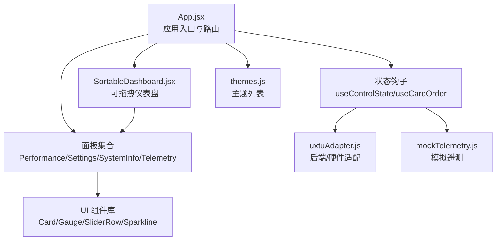
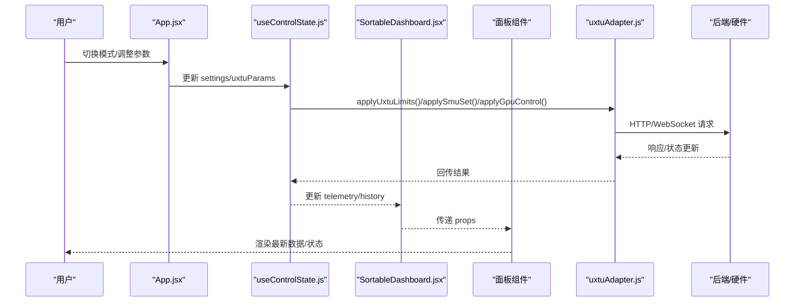
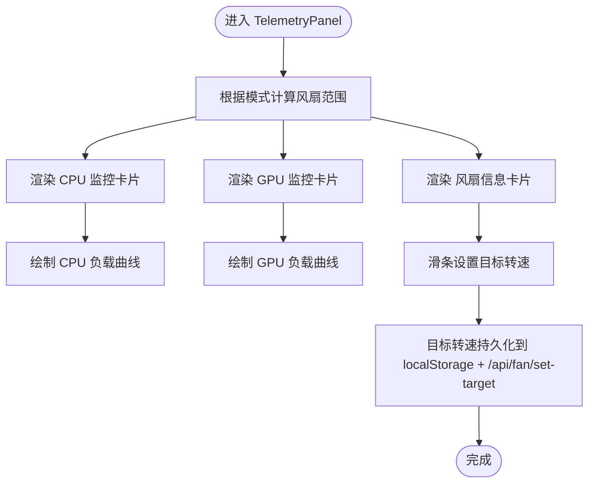
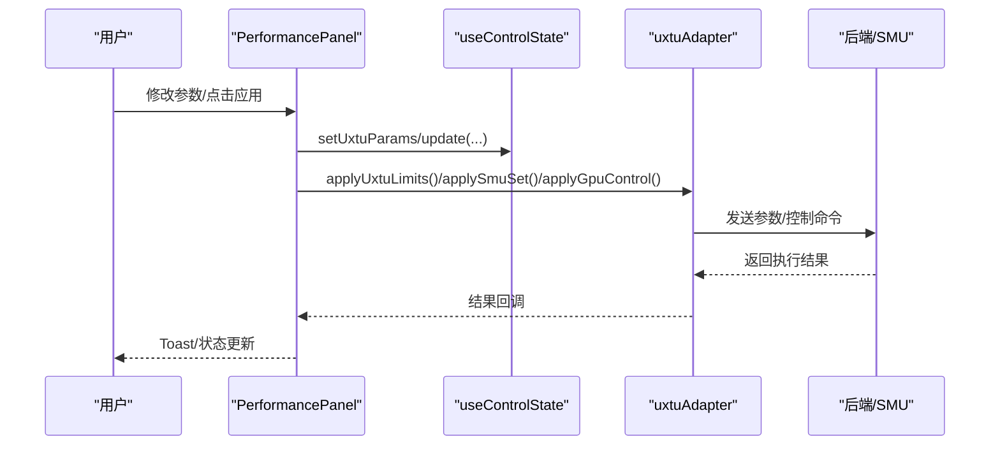
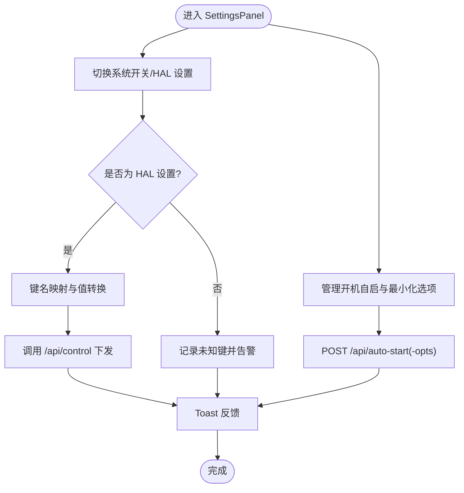
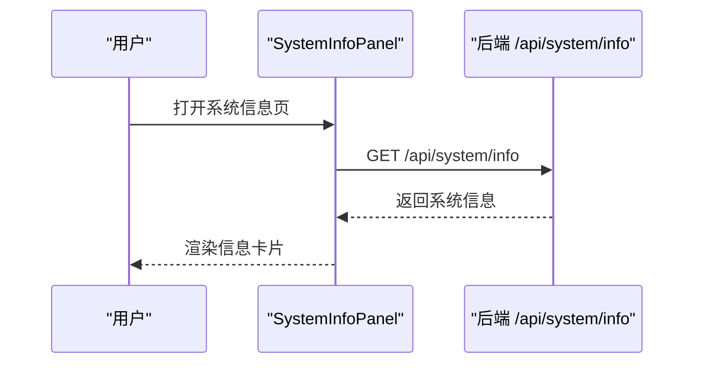
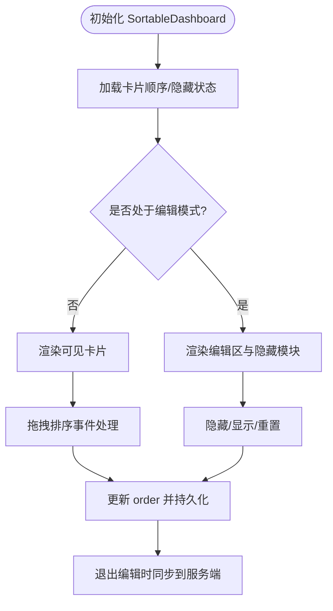
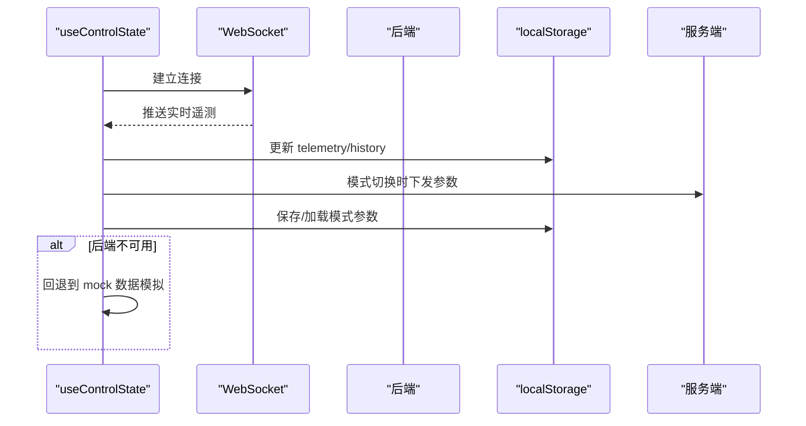
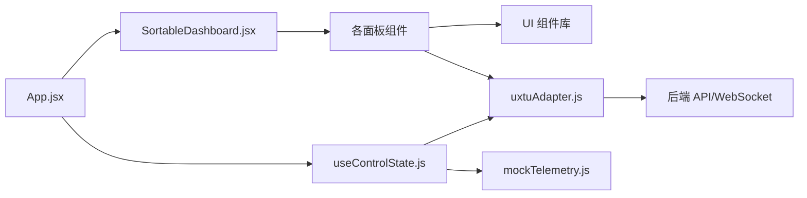

# 面板系统

<cite>
**本文引用的文件**
- [src/App.jsx](file://src/App.jsx)
- [src/components/SortableDashboard.jsx](file://src/components/SortableDashboard.jsx)
- [src/components/panels/TelemetryPanel.jsx](file://src/components/panels/TelemetryPanel.jsx)
- [src/components/panels/PerformancePanel.jsx](file://src/components/panels/PerformancePanel.jsx)
- [src/components/panels/SettingsPanel.jsx](file://src/components/panels/SettingsPanel.jsx)
- [src/components/panels/SystemInfoPanel.jsx](file://src/components/panels/SystemInfoPanel.jsx)
- [src/hooks/useControlState.js](file://src/hooks/useControlState.js)
- [src/hooks/useCardOrder.js](file://src/hooks/useCardOrder.js)
- [src/services/uxtuAdapter.js](file://src/services/uxtuAdapter.js)
- [src/data/mockTelemetry.js](file://src/data/mockTelemetry.js)
- [src/components/ui/Card.jsx](file://src/components/ui/Card.jsx)
- [src/components/ui/Gauge.jsx](file://src/components/ui/Gauge.jsx)
- [src/components/ui/SliderRow.jsx](file://src/components/ui/SliderRow.jsx)
- [src/components/ui/Sparkline.jsx](file://src/components/ui/Sparkline.jsx)
- [src/data/themes.js](file://src/data/themes.js)
</cite>

## 目录
1. [简介](#简介)
2. [项目结构](#项目结构)
3. [核心组件](#核心组件)
4. [架构总览](#架构总览)
5. [详细组件分析](#详细组件分析)
6. [依赖关系分析](#依赖关系分析)
7. [性能与内存优化](#性能与内存优化)
8. [故障排查指南](#故障排查指南)
9. [结论](#结论)
10. [附录：扩展与定制指南](#附录扩展与定制指南)

## 简介
本文件系统性梳理“面板系统”的设计与实现，覆盖以下方面：
- 面板功能定位与实现原理：遥测面板的数据展示、性能面板的参数调节、设置面板的配置管理、系统信息面板的数据汇总。
- 面板间通信机制、数据流传递与状态同步方式。
- 动态加载、懒加载优化与内存管理策略。
- 面板扩展方法：新增面板、布局定制与主题适配。

## 项目结构
前端采用 React + 自研 UI 组件库与服务适配层，通过“状态钩子 + 服务适配 + 面板组件”三层协作实现控制台功能。主要目录与职责如下：
- src/App.jsx：应用入口与路由分发，承载全局状态与导航。
- src/components/panels/*：各功能面板组件，负责具体 UI 与交互。
- src/components/SortableDashboard.jsx：可拖拽仪表盘容器，负责卡片编排与渲染。
- src/hooks/useControlState.js：全局状态钩子，统一管理遥测、参数、设置与历史数据。
- src/hooks/useCardOrder.js：卡片顺序与可见性持久化与同步。
- src/services/uxtuAdapter.js：后端 API 与 HAL 适配器，封装 WebSocket、HTTP 请求与参数下发。
- src/data/mockTelemetry.js：本地模拟遥测数据，用于后端不可用时的回退。
- src/components/ui/*：基础 UI 组件（卡片、仪表、滑条、折线图等）。

图表来源
- [src/App.jsx:1-134](file://src/App.jsx#L1-L134)
- [src/components/SortableDashboard.jsx:1-247](file://src/components/SortableDashboard.jsx#L1-L247)
- [src/hooks/useControlState.js:1-355](file://src/hooks/useControlState.js#L1-L355)
- [src/services/uxtuAdapter.js:1-130](file://src/services/uxtuAdapter.js#L1-L130)
- [src/data/mockTelemetry.js:1-22](file://src/data/mockTelemetry.js#L1-L22)
- [src/data/themes.js:1-34](file://src/data/themes.js#L1-L34)

章节来源
- [src/App.jsx:1-134](file://src/App.jsx#L1-L134)
- [src/components/SortableDashboard.jsx:1-247](file://src/components/SortableDashboard.jsx#L1-L247)

## 核心组件
- 遥测面板（TelemetryPanel）：以内联形式在仪表盘中渲染 CPU/GPU 监控、风扇信息与负载曲线，展示实时数据与历史趋势。
- 性能面板（PerformancePanel）：提供 CPU/GPU 参数调节界面，支持频率限制、温度墙、核心数限制、电源计划与电压/功耗调节，并具备 SMU 参数队列下发与 GPU 控制。
- 设置面板（SettingsPanel）：集中管理系统开关、键盘灯亮度、开机自启与关于信息，同时对接 HAL 硬件控制。
- 系统信息面板（SystemInfoPanel）：展示机型、CPU/GPU、内存、存储等静态系统信息，通过 /api/system/info 获取。

章节来源
- [src/components/panels/TelemetryPanel.jsx:1-121](file://src/components/panels/TelemetryPanel.jsx#L1-L121)
- [src/components/panels/PerformancePanel.jsx:1-213](file://src/components/panels/PerformancePanel.jsx#L1-L213)
- [src/components/panels/SettingsPanel.jsx:1-124](file://src/components/panels/SettingsPanel.jsx#L1-L124)
- [src/components/panels/SystemInfoPanel.jsx:1-59](file://src/components/panels/SystemInfoPanel.jsx#L1-L59)

## 架构总览
整体采用“状态中心 + 服务适配 + 面板渲染”的分层架构：
- 状态中心：useControlState 提供全局状态（遥测、参数、设置、历史），并维护 WebSocket 连接与后端回退逻辑。
- 服务适配：uxtuAdapter 封装后端 API（/api/*）、HAL 控制（/api/control）、SMU 参数下发（/api/smu/set）、GPU 控制（/api/gpu/*）与遥测 WebSocket（ws://127.0.0.1:3100/ws）。
- 面板渲染：App.jsx 负责页面级路由与模式切换；SortableDashboard.jsx 负责卡片编排与渲染；各面板组件消费状态并触发适配器调用。

图表来源
- [src/App.jsx:86-128](file://src/App.jsx#L86-L128)
- [src/hooks/useControlState.js:171-240](file://src/hooks/useControlState.js#L171-L240)
- [src/services/uxtuAdapter.js:19-88](file://src/services/uxtuAdapter.js#L19-L88)

## 详细组件分析

### 遥测面板（TelemetryPanel）
- 功能定位：展示 CPU/GPU 即时使用率、温度、频率、显存占用与风扇转速，以及 CPU/GPU 负载曲线。
- 实现要点：
  - 使用 Gauge 与 Sparkline 展示指标与趋势。
  - 风扇信息包含目标转速滑条与负载百分比，目标值通过 getFanRange 与当前模式联动。
  - 当前版本为兼容仪表盘内联渲染，该文件标注为“已弃用”，保留供未来复用。

图表来源
- [src/components/panels/TelemetryPanel.jsx:20-121](file://src/components/panels/TelemetryPanel.jsx#L20-L121)
- [src/services/uxtuAdapter.js:117-119](file://src/services/uxtuAdapter.js#L117-L119)

章节来源
- [src/components/panels/TelemetryPanel.jsx:1-121](file://src/components/panels/TelemetryPanel.jsx#L1-L121)

### 性能面板（PerformancePanel）
- 功能定位：对 CPU/GPU 参数进行精细调节，包括频率限制、温度墙、核心数限制、电源计划、电压与功耗等。
- 实现要点：
  - 参数变更通过队列函数（如 queueSmu、queueCoreLimit）去抖合并，降低频繁下发带来的系统开销。
  - 电源计划映射至 HAL 值，支持即时下发硬件控制。
  - GPU 控制支持锁定/限制/重置等动作，结合 SMU 参数联动。
  - 提供“应用”按钮与 Toast 反馈，确保用户感知操作结果。

图表来源
- [src/components/panels/PerformancePanel.jsx:55-67](file://src/components/panels/PerformancePanel.jsx#L55-L67)
- [src/services/uxtuAdapter.js:19-88](file://src/services/uxtuAdapter.js#L19-L88)

章节来源
- [src/components/panels/PerformancePanel.jsx:1-213](file://src/components/panels/PerformancePanel.jsx#L1-L213)

### 设置面板（SettingsPanel）
- 功能定位：集中管理系统开关（如锁键、触摸板）、键盘灯亮度、开机自启与关于信息；部分设置通过 HAL 下发到硬件。
- 实现要点：
  - 对于 HAL 支持的设置（如 kb_light、fn_lock 等）进行键名映射与值转换后下发。
  - 开机自启通过 /api/auto-start 与 /api/auto-start-opts 控制，提供成功/失败反馈。
  - 关于信息展示版本与开发者信息。

图表来源
- [src/components/panels/SettingsPanel.jsx:49-73](file://src/components/panels/SettingsPanel.jsx#L49-L73)
- [src/components/panels/SettingsPanel.jsx:23-48](file://src/components/panels/SettingsPanel.jsx#L23-L48)

章节来源
- [src/components/panels/SettingsPanel.jsx:1-124](file://src/components/panels/SettingsPanel.jsx#L1-L124)

### 系统信息面板（SystemInfoPanel）
- 功能定位：展示机型、CPU/GPU、内存、存储等静态系统信息。
- 实现要点：
  - 首次挂载时通过 /api/system/info 获取信息，失败时回退为空对象占位。
  - 采用 Section/Row 子组件组织信息展示，保持一致的样式与可读性。

图表来源
- [src/components/panels/SystemInfoPanel.jsx:7-12](file://src/components/panels/SystemInfoPanel.jsx#L7-L12)

章节来源
- [src/components/panels/SystemInfoPanel.jsx:1-59](file://src/components/panels/SystemInfoPanel.jsx#L1-L59)

### 仪表盘与卡片编排（SortableDashboard）
- 功能定位：提供可拖拽的卡片布局，支持显示/隐藏、重置排序与服务端同步。
- 实现要点：
  - renderCard 根据卡片 ID 渲染对应内容（CPU/GPU 监控、风扇、调节面板、系统开关、关于等）。
  - 使用 useCardOrder 管理卡片顺序与隐藏状态，支持 localStorage 与服务端同步。
  - 编辑模式下暴露“全部显示/重置排序/隐藏模块”等操作。

图表来源
- [src/components/SortableDashboard.jsx:38-192](file://src/components/SortableDashboard.jsx#L38-L192)
- [src/hooks/useCardOrder.js:46-127](file://src/hooks/useCardOrder.js#L46-L127)

章节来源
- [src/components/SortableDashboard.jsx:1-247](file://src/components/SortableDashboard.jsx#L1-L247)
- [src/hooks/useCardOrder.js:1-128](file://src/hooks/useCardOrder.js#L1-L128)

### 全局状态与数据流（useControlState）
- 功能定位：统一管理主题、遥测、参数、设置、历史数据与后端连接，提供模式切换、参数持久化与回退逻辑。
- 实现要点：
  - 遥测历史（history）基于最近 N 次更新追加，用于折线图展示。
  - 模式切换时将当前参数保存到旧模式键，再从新模式键或预设加载；自定义模式从服务端加载。
  - 风扇目标转速变更采用去抖（600ms）写入后端与本地存储。
  - 自定义参数在自定义模式下每秒去抖保存到服务端，同时将电压偏移持久化到本地。
  - WebSocket 连接后端（ws://127.0.0.1:3100/ws），后端离线时回退到 mock 数据模拟。

图表来源
- [src/hooks/useControlState.js:242-336](file://src/hooks/useControlState.js#L242-L336)
- [src/data/mockTelemetry.js:1-22](file://src/data/mockTelemetry.js#L1-L22)

章节来源
- [src/hooks/useControlState.js:1-355](file://src/hooks/useControlState.js#L1-L355)

## 依赖关系分析
- 组件耦合：
  - App.jsx 作为顶层容器，向下传递状态与回调给 SortableDashboard 与各面板。
  - SortableDashboard 通过 renderCard 将面板组件组合，形成卡片级解耦。
  - 各面板组件依赖 UI 组件库与服务适配器，彼此低耦合。
- 外部依赖：
  - 后端 API：/api/uxtu/apply、/api/control、/api/smu/set、/api/gpu/*、/api/system/info、/api/auto-start、/api/auto-start-opts、/api/ui-state、/api/custom-params。
  - HAL/SMU/GPU 控制：通过 /api/control 与 /api/smu/set、/api/gpu/* 下发。
  - WebSocket：ws://127.0.0.1:3100/ws 获取实时遥测。

图表来源
- [src/App.jsx:1-134](file://src/App.jsx#L1-L134)
- [src/components/SortableDashboard.jsx:1-247](file://src/components/SortableDashboard.jsx#L1-L247)
- [src/services/uxtuAdapter.js:1-130](file://src/services/uxtuAdapter.js#L1-L130)

章节来源
- [src/App.jsx:1-134](file://src/App.jsx#L1-L134)
- [src/services/uxtuAdapter.js:1-130](file://src/services/uxtuAdapter.js#L1-L130)

## 性能与内存优化
- 去抖与节流：
  - 风扇目标转速变更去抖 600ms，减少后端压力与硬件抖动。
  - 自定义参数保存去抖 1000ms，避免频繁网络请求。
  - SMU 参数与核心数限制变更采用定时器合并，降低 SMU 写入频率。
- 内存与渲染优化：
  - 遥测历史仅保留固定长度数组（MAX_HISTORY），避免无限增长。
  - 折线图构建仅对有效数值进行归一化与点序列生成，避免无效渲染。
  - 拖拽排序仅在退出编辑模式时同步到服务端，减少网络交互。
- 回退与容错：
  - WebSocket 断线自动重连，后端不可用时回退到 mock 数据模拟，保证 UI 流畅。
- 主题与资源：
  - 主题切换通过设置 body 类名，CSS 变量生效，避免重复渲染。

章节来源
- [src/hooks/useControlState.js:112-126](file://src/hooks/useControlState.js#L112-L126)
- [src/hooks/useControlState.js:144-169](file://src/hooks/useControlState.js#L144-L169)
- [src/hooks/useControlState.js:33-56](file://src/hooks/useControlState.js#L33-L56)
- [src/components/ui/Sparkline.jsx:1-40](file://src/components/ui/Sparkline.jsx#L1-L40)
- [src/services/uxtuAdapter.js:58-71](file://src/services/uxtuAdapter.js#L58-L71)

## 故障排查指南
- 遥测无数据或异常：
  - 检查 WebSocket 是否连接成功（ws://127.0.0.1:3100/ws），若断开会自动重连。
  - 后端不可用时将回退到 mock 数据，确认本地 mock 数据是否正常。
- 参数下发失败：
  - 查看 PerformancePanel 的 Toast 反馈与错误日志，确认 /api/uxtu/apply、/api/smu/set、/api/gpu/* 是否可用。
  - 检查 SMU 参数队列是否被去抖合并，等待定时器触发。
- 硬件控制不生效：
  - 检查 SettingsPanel 的 HAL 映射与 /api/control 返回值，确认键名与值转换正确。
- 卡片排序不同步：
  - 确认退出编辑模式后是否触发了同步；检查 /api/ui-state 的 POST 是否成功。
- 开机自启设置失败：
  - 检查 /api/auto-start 与 /api/auto-start-opts 的响应与错误提示。

章节来源
- [src/services/uxtuAdapter.js:58-71](file://src/services/uxtuAdapter.js#L58-L71)
- [src/components/panels/PerformancePanel.jsx:55-67](file://src/components/panels/PerformancePanel.jsx#L55-L67)
- [src/components/panels/SettingsPanel.jsx:23-48](file://src/components/panels/SettingsPanel.jsx#L23-L48)
- [src/hooks/useCardOrder.js:78-91](file://src/hooks/useCardOrder.js#L78-L91)

## 结论
面板系统通过清晰的状态中心、服务适配与组件化设计，实现了高性能、可扩展且易维护的硬件控制与监控体验。其关键优势包括：
- 状态与数据流集中管理，便于调试与扩展；
- 参数下发与硬件控制具备去抖与合并策略，兼顾稳定性与效率；
- 仪表盘支持动态布局与主题切换，满足个性化需求；
- 回退与容错机制保障在后端不可用时仍可流畅使用。

## 附录：扩展与定制指南

### 新增面板组件
- 创建组件文件：在 src/components/panels/ 下新增面板组件，遵循现有命名与导出规范。
- 引入到仪表盘：在 SortableDashboard 的 renderCard 中添加卡片 ID 与渲染逻辑。
- 注册卡片映射：在 CARD_MAP 中为新卡片添加 label，以便编辑区显示友好名称。
- 状态接入：通过 useControlState 提供的 props（telemetry/history/settings/uxtuParams 等）消费数据；需要下发时调用 uxtuAdapter 的相应接口。
- UI 组件复用：优先使用 Card、Gauge、SliderRow、Sparkline 等基础组件，保持风格一致。

章节来源
- [src/components/SortableDashboard.jsx:25-36](file://src/components/SortableDashboard.jsx#L25-L36)
- [src/components/SortableDashboard.jsx:73-192](file://src/components/SortableDashboard.jsx#L73-L192)

### 布局定制
- 卡片顺序与隐藏：通过 useCardOrder 管理，默认顺序与隐藏项可通过本地存储与服务端同步。
- 编辑模式：在仪表盘侧边栏切换“排序”按钮进入编辑模式，支持隐藏/显示卡片与重置排序。
- 响应式网格：仪表盘采用多列栅格布局，卡片内部可按需拆分为子网格（如内存+硬盘）。

章节来源
- [src/hooks/useCardOrder.js:46-127](file://src/hooks/useCardOrder.js#L46-L127)
- [src/components/SortableDashboard.jsx:194-246](file://src/components/SortableDashboard.jsx#L194-L246)

### 主题适配
- 主题列表：在 themes.js 中维护主题 ID 与名称，ThemeSwitcher 负责切换。
- CSS 变量：主题通过设置 body 的类名，使 CSS 变量（如 --bg、--card、--primary 等）生效，无需重绘组件。
- 新主题建议：新增主题 ID 与名称，确保变量覆盖完整，避免局部样式失效。

章节来源
- [src/data/themes.js:1-34](file://src/data/themes.js#L1-L34)
- [src/App.jsx:39-40](file://src/App.jsx#L39-L40)