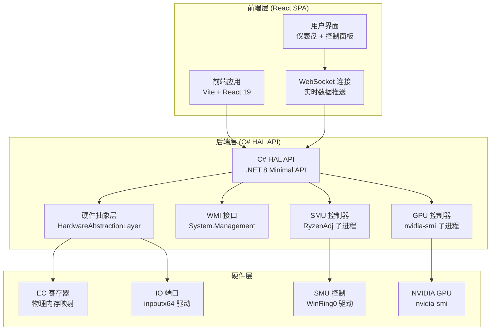
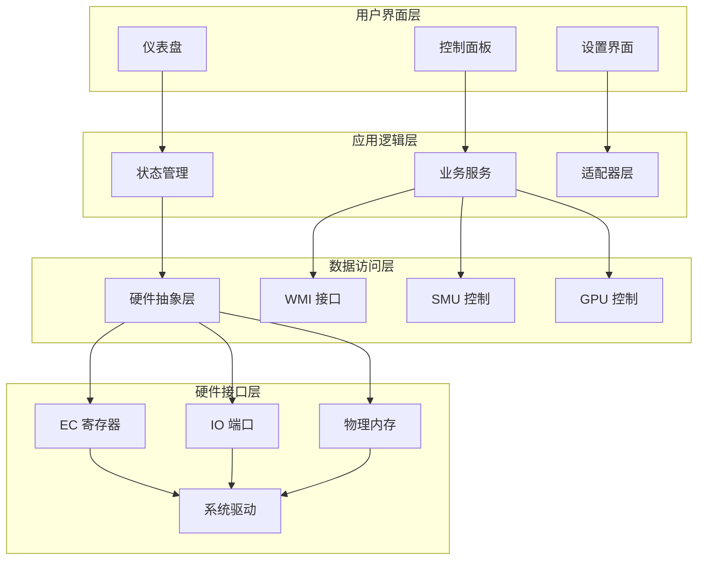
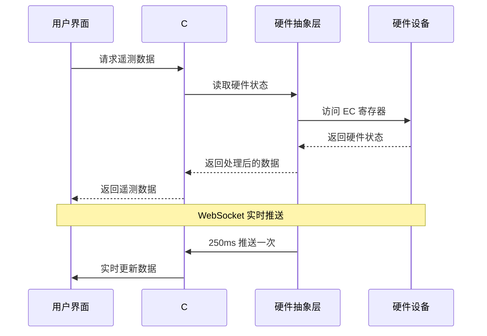
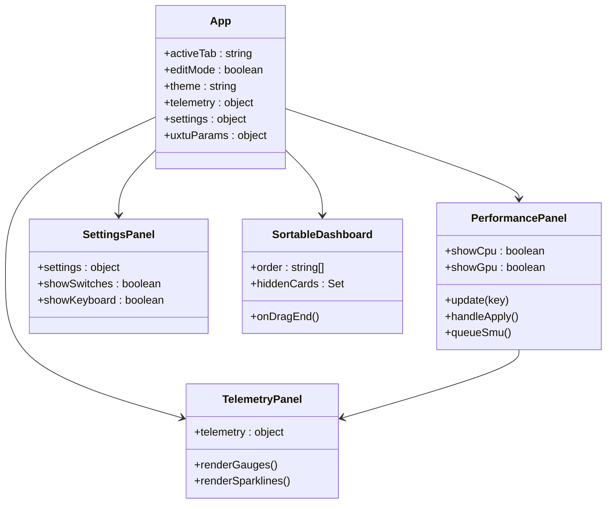
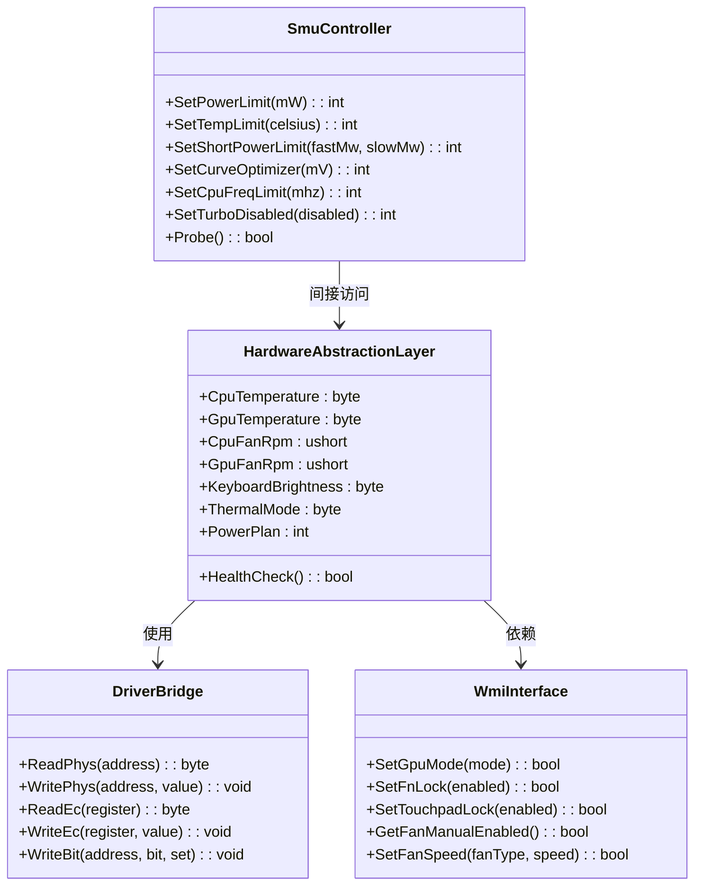
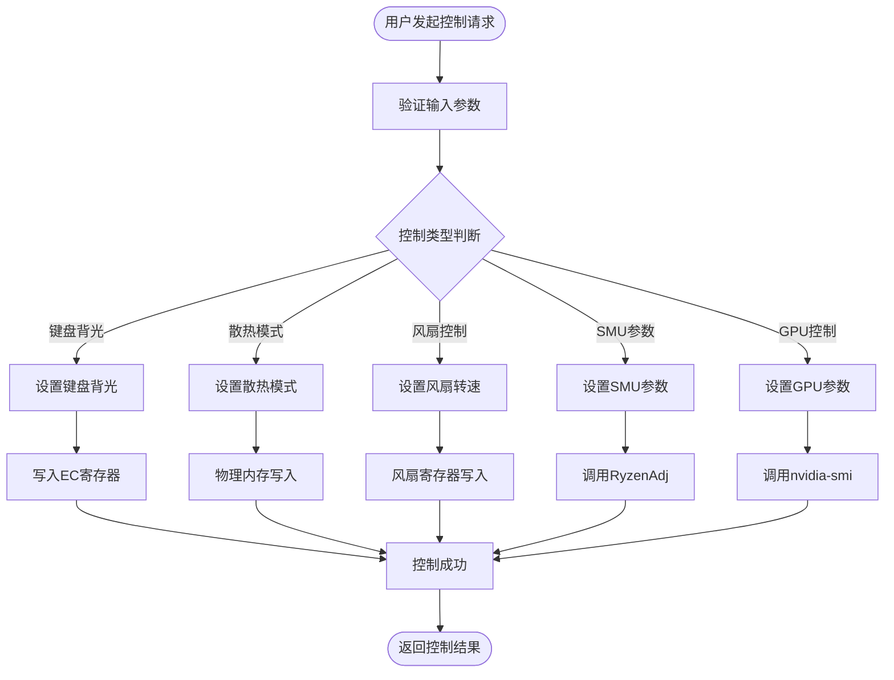
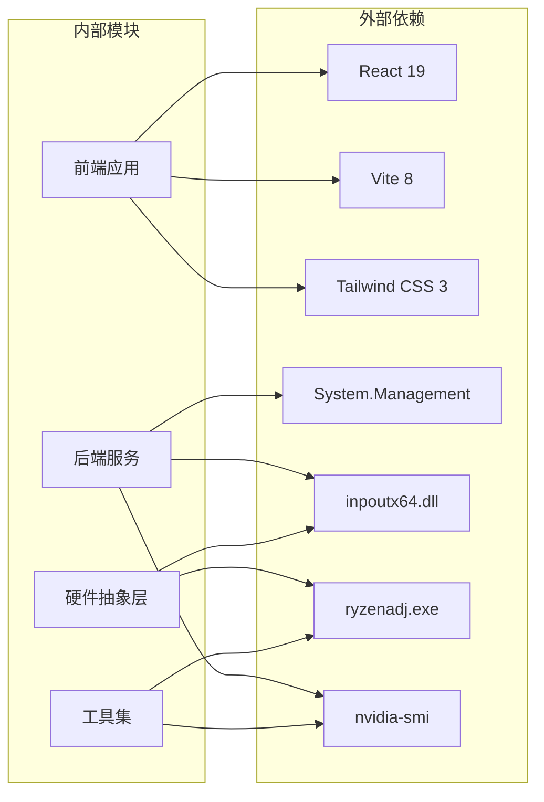

# 项目概述

<cite>
**本文档引用的文件**
- [README.md](file://README.md)
- [dev-architecture.md](file://docs/dev-architecture.md)
- [dev-backend.md](file://docs/dev-backend.md)
- [dev-frontend.md](file://docs/dev-frontend.md)
- [Program.cs](file://server/api/Program.cs)
- [HardwareAbstractionLayer.cs](file://server/hal/HardwareAbstractionLayer.cs)
- [DriverBridge.cs](file://server/hal/DriverBridge.cs)
- [SmuController.cs](file://server/hal/SmuController.cs)
- [App.jsx](file://src/App.jsx)
- [PerformancePanel.jsx](file://src/components/panels/PerformancePanel.jsx)
- [dashboard-default.json](file://server/config/dashboard-default.json)
</cite>

## 目录
1. [项目简介](#项目简介)
2. [项目结构](#项目结构)
3. [核心组件](#核心组件)
4. [架构概览](#架构概览)
5. [详细组件分析](#详细组件分析)
6. [依赖关系分析](#依赖关系分析)
7. [性能考虑](#性能考虑)
8. [故障排除指南](#故障排除指南)
9. [结论](#结论)
10. [附录](#附录)

## 项目简介

DOUZHANZHE-Control 是一个专为联想拯救者系列笔记本设计的开源硬件控制与监控系统。该项目旨在替代官方联想电脑管家，为用户提供完整的硬件监控、性能调优和系统控制能力。

### 主要功能特性

系统提供了全面的硬件控制能力，包括：

**硬件监控功能**：
- CPU/GPU 占用率、温度、频率实时监控
- 显存使用情况监控
- 风扇转速监控（CPU/GPU 风扇）
- 内存使用率和磁盘使用情况监控

**散热控制功能**：
- 四种散热模式：静音/均衡/野兽/自定义
- 独立风扇控制（CPU/GPU 风扇精确 RPM 控制）
- 键盘背光亮度调节（0-3级）

**性能调优功能**：
- AMD SMU 控制（功耗墙、温度墙、频率限制）
- NVIDIA GPU 锁频和频率限制
- 电源计划切换
- CPU 核心数限制

**系统控制功能**：
- Fn 键锁定切换
- CapsLock/NumLock 键切换
- 触摸板锁定
- GPU 模式切换（混合/集显/独显）

### 技术价值

该项目展现了以下技术价值：

1. **跨平台硬件抽象**：通过统一的硬件抽象层，屏蔽底层硬件差异
2. **实时监控架构**：采用 WebSocket 实时推送机制，提供流畅的用户体验
3. **安全权限管理**：合理分配管理员权限，确保硬件控制的安全性
4. **模块化设计**：前后端分离，各组件职责清晰，便于维护和扩展

## 项目结构

项目采用前后端分离的架构设计，主要分为三个层次：

**图表来源**
- [dev-architecture.md:12-46](file://docs/dev-architecture.md#L12-L46)
- [Program.cs:10-14](file://server/api/Program.cs#L10-L14)

### 核心模块组织

项目采用清晰的模块化组织结构：

**前端模块**：
- `src/` - React 前端应用源码
- `src/components/` - 可复用 UI 组件
- `src/services/` - API 服务封装
- `src/hooks/` - React Hooks
- `src/data/` - 静态数据和主题配置

**后端模块**：
- `server/api/` - C# Web API 服务
- `server/hal/` - 硬件抽象层
- `server/config/` - 运行时配置文件
- `server/tools/` - 硬件访问工具

**文档模块**：
- `docs/` - 详细的开发文档

**章节来源**
- [dev-architecture.md:200-225](file://docs/dev-architecture.md#L200-L225)

## 核心组件

### 硬件抽象层 (HAL)

HardwareAbstractionLayer 是整个系统的核心，负责将底层硬件操作抽象为语义化的 C# 属性和方法：

**主要职责**：
- EC 寄存器地址映射为 C# 属性
- 硬件状态读取和控制
- 系统信息获取
- 遥测数据缓存和刷新

**关键特性**：
- 支持 150+ EC 寄存器的读写
- 线程安全的硬件访问
- 智能缓存机制减少硬件访问频率
- 异常处理和回退机制

**章节来源**
- [HardwareAbstractionLayer.cs:19-767](file://server/hal/HardwareAbstractionLayer.cs#L19-L767)

### 驱动桥接层 (DriverBridge)

DriverBridge 提供了与底层硬件驱动的桥接功能：

**核心功能**：
- inpoutx64 驱动的 P/Invoke 封装
- 物理内存读写操作
- IO 端口访问
- EC 寄存器协议实现

**技术特点**：
- 单例模式确保资源管理
- 线程安全的硬件访问
- 支持多种硬件访问方式
- 自动驱动初始化和状态检查

**章节来源**
- [DriverBridge.cs:9-133](file://server/hal/DriverBridge.cs#L9-L133)

### SMU 控制器

SMU (System Management Unit) 控制器专门处理 AMD 处理器的硬件管理：

**功能特性**：
- 通过 RyzenAdj 子进程进行 SMU 参数设置
- 支持功耗墙、温度墙、频率限制等高级功能
- WinRing0 驱动集成
- 多种 SMU 命令的封装

**章节来源**
- [SmuController.cs:12-142](file://server/hal/SmuController.cs#L12-L142)

### Web API 服务

C# Web API 服务提供了完整的 RESTful API 接口：

**核心端点**：
- `/api/telemetry` - 遥测数据获取
- `/api/control` - 硬件控制
- `/api/smu/set` - SMU 参数设置
- `/api/gpu/set` - GPU 控制
- `/ws` - WebSocket 实时数据推送

**章节来源**
- [Program.cs:87-584](file://server/api/Program.cs#L87-L584)

## 架构概览

系统采用分层架构设计，实现了前后端分离和硬件抽象：

**图表来源**
- [dev-architecture.md:10-46](file://docs/dev-architecture.md#L10-L46)
- [dev-backend.md:27-38](file://docs/dev-backend.md#L27-L38)

### 数据流架构

系统实现了高效的实时数据流架构：

**图表来源**
- [dev-architecture.md:56-87](file://docs/dev-architecture.md#L56-L87)

## 详细组件分析

### 前端架构分析

前端采用现代化的 React 19 + Vite 架构，提供了丰富的用户交互体验：

**图表来源**
- [App.jsx:23-134](file://src/App.jsx#L23-L134)
- [PerformancePanel.jsx:13-213](file://src/components/panels/PerformancePanel.jsx#L13-L213)

#### 状态管理系统

前端实现了复杂的状态管理机制：

**核心状态**：
- `telemetry`: 实时硬件遥测数据
- `uxtuParams`: SMU 参数配置
- `settings`: 系统设置和模式选择
- `history`: 实时负载历史数据

**持久化策略**：
- localStorage: 即时状态持久化
- 服务端 JSON: 配置文件持久化
- 仪表盘排序: 支持拖拽排序

**章节来源**
- [dev-frontend.md:172-197](file://docs/dev-frontend.md#L172-L197)

### 后端服务架构

后端采用 C# .NET 8 Minimal API 架构，提供了高性能的硬件控制服务：

**图表来源**
- [HardwareAbstractionLayer.cs:19-767](file://server/hal/HardwareAbstractionLayer.cs#L19-L767)
- [DriverBridge.cs:9-133](file://server/hal/DriverBridge.cs#L9-L133)
- [SmuController.cs:12-142](file://server/hal/SmuController.cs#L12-L142)

#### 硬件控制流程

系统实现了完整的硬件控制流程：

**图表来源**
- [Program.cs:144-202](file://server/api/Program.cs#L144-L202)

**章节来源**
- [dev-backend.md:107-125](file://docs/dev-backend.md#L107-L125)

### 配置管理分析

系统提供了灵活的配置管理机制：

**配置文件**：
- `dashboard-default.json`: 仪表盘默认配置
- `ui-state.json`: 用户界面状态持久化
- `custom-params.json`: 自定义参数配置

**配置特性**：
- 支持多模式参数记忆
- 服务端和客户端双重持久化
- 拖拽排序和卡片隐藏功能

**章节来源**
- [dashboard-default.json:1-7](file://server/config/dashboard-default.json#L1-L7)
- [dev-frontend.md:161-171](file://docs/dev-frontend.md#L161-L171)

## 依赖关系分析

系统采用了清晰的依赖关系设计，确保了模块间的松耦合：

**图表来源**
- [dev-architecture.md:99-107](file://docs/dev-architecture.md#L99-L107)
- [dev-backend.md:204-225](file://docs/dev-backend.md#L204-L225)

### 关键依赖特性

**前端依赖**：
- React 19: 现代化 React 框架
- Vite 8: 高性能构建工具
- Tailwind CSS 3: 实用优先的 CSS 框架
- @dnd-kit: 拖拽排序组件库

**后端依赖**：
- .NET 8: 跨平台运行时
- System.Management: WMI 接口
- inpoutx64: 硬件访问驱动

**工具依赖**：
- RyzenAdj: AMD SMU 控制工具
- nvidia-smi: NVIDIA GPU 监控工具

**章节来源**
- [dev-architecture.md:103-113](file://docs/dev-architecture.md#L103-L113)

## 性能考虑

系统在设计时充分考虑了性能优化：

### 硬件访问优化

**缓存策略**：
- 硬件状态缓存减少频繁硬件访问
- 智能刷新机制避免过度查询
- 多级缓存层次结构

**并发控制**：
- 线程安全的硬件访问
- 互斥锁保护共享资源
- 异步操作避免阻塞

### 网络传输优化

**数据压缩**：
- WebSocket 实时推送减少网络开销
- 增量更新机制
- 250ms 轮询间隔平衡实时性与性能

**连接管理**：
- 自动重连机制
- 连接状态监控
- 断线恢复策略

## 故障排除指南

### 常见问题及解决方案

**驱动加载失败**：
- 确保以管理员权限运行
- 检查 inpoutx64 驱动状态
- 验证系统兼容性

**硬件访问异常**：
- 检查 EC 寄存器访问权限
- 验证硬件支持状态
- 查看日志输出定位问题

**SMU 控制失效**：
- 确认 WinRing0 驱动加载
- 检查 RyzenAdj 可执行文件
- 验证硬件兼容性

**章节来源**
- [dev-backend.md:129-132](file://docs/dev-backend.md#L129-L132)

### 调试工具

系统提供了完善的调试工具：

**内置调试面板**：
- 直接硬件控制测试
- 实时遥测监控
- 硬件状态检查

**日志记录**：
- 详细的错误日志
- 硬件访问记录
- 性能监控数据

## 结论

DOUZHANZHE-Control 是一个设计精良的硬件控制与监控系统，具有以下突出特点：

### 技术优势

1. **架构设计优秀**：前后端分离，模块化设计，职责清晰
2. **硬件抽象完善**：统一的 HAL 层屏蔽硬件差异
3. **实时性能优异**：250ms 轮询 + WebSocket 推送
4. **安全性考虑周全**：合理的权限管理和错误处理

### 适用场景

- 联想拯救者系列笔记本用户
- 需要深度硬件控制的高级用户
- 系统性能调优和监控需求
- 自定义硬件配置场景

### 差异化优势

1. **OEM 机型适配**：专门为宝龙达 OEM 模具优化
2. **功能完整性**：涵盖从监控到控制的完整功能链
3. **开源透明**：完全开源，可审计和定制
4. **社区支持**：活跃的开发者社区和持续维护

该项目为联想拯救者用户提供了一个强大、可靠、易用的硬件控制解决方案，是同类产品中的优秀代表。

## 附录

### 快速开始

**前置要求**：
- .NET SDK 8.0 (net8.0-windows)
- Node.js >= 18
- Windows 10/11 x64
- 管理员权限

**启动步骤**：
1. 启动 C# HAL API 服务
2. 启动 Vite 前端开发服务器
3. 可选：启动 Node.js 配置持久化服务

### 技术规格

**支持的硬件**：
- 联想拯救者 N176 2025 (宝龙达 OEM)
- AMD Ryzen 处理器系列
- NVIDIA GPU 系列

**系统要求**：
- Windows 10/11 x64
- 管理员权限运行
- 足够的系统资源